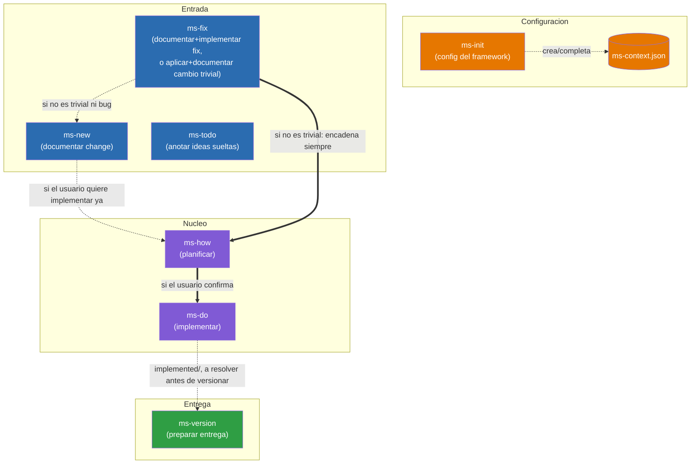

# Diseño — Framework `ms-*`

Mapa de las skills que componen el framework `ms-*` y cómo se invocan entre sí.

## Índice

- [Diagrama de relaciones](#diagrama-de-relaciones)
- [Responsabilidades de cada skill](#responsabilidades-de-cada-skill)
  - [Invocables por el usuario](#invocables-por-el-usuario)
  - [Internas y de soporte](#internas-y-de-soporte)

## Diagrama de relaciones

Diagrama simplificado con solo el flujo principal visible al usuario. Las skills internas (`ms-internal-workflow`, `ms-internal-tech-analysis`, `ms-internal-doc-features`, `ms-internal-changelog`) y de soporte (`ms-status`) no aparecen aquí — su relación con el resto está descrita en la sección de responsabilidades más abajo. El flujo interno de `ms-version`/`ms-internal-changelog` (con guardarraíles y detalle paso a paso) tiene su propio diagrama, no duplicado aquí: [`.claude/skills/ms-version/version-flow-diagram.template.md`](skills/ms-version/version-flow-diagram.template.md).

`ms-how` (planificar) y `ms-do` (implementar) son dos skills separadas: `ms-how` analiza la solución técnica y escribe `plan.md`, y solo si el usuario confirma que quiere implementar ya, encadena `ms-do`, que es quien edita el código. También se puede invocar `ms-do` directamente sobre una entrada que ya tenga `plan.md`, sin pasar por `ms-how` de nuevo.

Leyenda:
- Flechas sólidas (`-->`, `==>`): invocación directa de skill a skill dentro del mismo proceso.
- Flechas punteadas (`-.->`): dependencia de configuración o invocación condicional.
- `ms-todo` no tiene ninguna flecha hacia el resto del flujo: vive aislado en `{changesDir}/todo/`, ajeno al resto de skills.
- `ms-fix` es la única skill de "Entrada" que puede terminar sin pasar por `plan.md`: si el cambio (bug o no) de verdad califica como trivial, crea la entrada en `{changesDir}/inProgress/{xxxx}/` vía `ms-internal-workflow` (numeración `xxxx` normal) y la mueve a `implemented` en la misma invocación, sin generar `plan.md` ni encadenar `ms-how`/`ms-do`. Solo cae en `ms-new` cuando el análisis revela que no era trivial y tampoco es un bug (afecta a arquitectura/estilo, falta información, toca más de 2 ficheros, o es funcionalidad nueva).
- `ms-version` no consume la salida de `ms-do` directamente: solo exige, como guardarraíl de arranque, que `{changesDir}/implemented/` esté vacío (cada entrada resuelta se mueve a `closed` antes de continuar).
- Todas las skills leen `.claude/ms-context.json` para funcionar, no solo las que aparecen aquí conectadas a él — se omite esa flecha hacia cada una para no saturar el diagrama; `ms-init` es la única que lo escribe.

## Responsabilidades de cada skill

### Invocables por el usuario

- **ms-init** — Inicializa el framework: crea/completa `.claude/ms-context.json` (`framework.workFolder` — raíz relativa al repo bajo la que el framework gestiona `changes/` y `versions/`, subcarpetas de nombre fijo que las skills crean por sí mismas —, docs a sincronizar) y comprueba que las herramientas de línea de comandos necesarias estén instaladas. Único punto de configuración del que dependen todas las demás skills. *Usa:* ninguna otra skill.
- **ms-new** — Documenta un cambio intencionado (funcionalidad nueva o modificación de comportamiento a propósito, no un bug). Invoca `ms-internal-tech-analysis` para reunir contexto técnico antes de anticipar dudas funcionales típicas, genera `description.md` vía `ms-internal-workflow` y, si aplica, maquetas visuales `design_*.html` y diagramas de navegación/interacción de UI `design_navigation_*.md`. No implementa nada por sí misma, pero si el usuario quiere implementar de inmediato puede invocar directamente `ms-how` sobre la entrada recién creada. *Usa:* `ms-internal-workflow`, `ms-internal-tech-analysis`, `ms-how`.
- **ms-fix** — Documenta un bug y lo implementa de punta a punta, y además es la vía rápida del framework para cambios tan pequeños que casi no requieren análisis (typo, texto, un valor/constante, un ajuste de estilo aislado, sea o no un bug). Primero invoca `ms-internal-tech-analysis` para valorar si lo pedido es `fast` (sin ambigüedad, ≤2 ficheros, sin afectar a `docs.tech.architectureDocDir`/`docs.tech.styleBibleDocDir` ni incongruencias detectadas con ellos, sin comportamiento nuevo). Si es `fast`, crea la entrada vía `ms-internal-workflow` (`action=create`, `type=fast`), aplica el cambio directamente y la mueve a `implemented` (`action=move`) en la misma invocación, sin `plan.md`. Si no es `fast` y es un bug, genera `description.md` vía `ms-internal-workflow` (`type=fix`) y encadena automáticamente `ms-how` para corregirlo de punta a punta, con el análisis acotado estrictamente a la causa raíz (sin ampliar alcance). Si no es `fast` y no es un bug, avisa al usuario e invoca `ms-new` con su petición. *Usa:* `ms-internal-workflow`, `ms-internal-tech-analysis`, `ms-new`, `ms-how`.
- **ms-how** — Toma una entrada ya documentada en `inProgress`, invoca `ms-internal-tech-analysis` para reunir el contexto técnico, analiza la solución técnica y escribe `plan.md`; si el usuario confirma que quiere implementar ya, encadena directamente `ms-do` sobre la misma entrada. *Usa:* `ms-internal-tech-analysis`, `ms-do`.
- **ms-do** — Toma una entrada de `inProgress` cuyo `plan.md` ya está escrito (por `ms-how`, o invocada directamente por el usuario), implementa el código, actualiza la documentación sincronizada (`docs.tech.architectureDocDir`/`docs.functional.featuresDocPathDir`/`docs.tech.styleBibleDocDir` — incluyendo cualquier incongruencia que `ms-internal-tech-analysis` haya reportado vía `ms-how`) y mueve la carpeta a `implemented` vía `ms-internal-workflow`. Si `docs.functional.featuresDocPathDir` es una carpeta, delega su lectura/escritura en `ms-internal-doc-features` en vez de tocarla directamente. *Usa:* `ms-internal-workflow`, `ms-internal-doc-features`.
- **ms-status** — Da una vista general de solo lectura del estado del proyecto (totales por tipo —incluido `fast`, el atajo trivial de `ms-fix`— y por estado, detalle de qué está solo descrito vs. listo para implementar, y listado aparte de los cambios `fast` ya aplicados). No crea, mueve ni modifica nada; el informe se entrega en el chat salvo que el usuario pida guardarlo. *Usa:* ninguna otra skill.
- **ms-todo** — Cuaderno de ideas sueltas, deliberadamente fuera del flujo de trabajo del framework: vive en `{changesDir}/todo/`, con numeración e identificadores propios que ninguna otra skill `ms-*` lee ni cuenta. Sirve para anotar ideas incompletas sin forzar el análisis de alcance de `ms-new`/`ms-fix`. *Usa:* ninguna otra skill.
- **ms-version** — Prepara una entrega en `{workFolder}/versions/{XXXX}/`: exige primero que `{changesDir}/implemented/` esté vacío (cada entrada se resuelve moviéndola a `closed`), genera el entregable siguiendo `{workFolder}/framework/how-to-compile-version.md` (procedimiento propio del proyecto, escrito la primera vez que hace falta, capaz de describir varios pasos si el build genera varios artefactos), comprime en `.zip` y copia `docs.tech.architectureDocDir`/`docs.tech.styleBibleDocDir`/`docs.functional.featuresDocPathDir` que estén configuradas, y encadena `ms-internal-changelog` para el changelog funcional. Si se invoca solo para informar de un cambio en el procedimiento de build, actualiza `{workFolder}/framework/how-to-compile-version.md` sin lanzar el resto del proceso salvo confirmación explícita. `{XXXX}` es texto libre elegido por el usuario en cada invocación, sin relación con la numeración `xxxx` de change/fix ni con ninguna otra carpeta "versions" que exista en el repo. *Usa:* `ms-internal-changelog`.

### Internas y de soporte

`ms-internal-workflow`, `ms-internal-tech-analysis` y `ms-internal-changelog` solo se ejecutan cuando otra skill del framework las invoca como parte de su propio proceso; si el usuario las invoca directamente (o pide "ejecuta X" en texto plano sin venir de ese contexto), se detienen sin hacer nada y redirigen a la skill correspondiente.

- **ms-internal-workflow** — Centraliza la mecánica de fichero del framework: numerar y crear entradas nuevas en `inProgress` (`action=create`, con `type` `change`/`fix`/`fast`), y mover carpetas entre estados (`action=move`). No analiza ni decide nada, solo ejecuta lo que la skill llamante ya resolvió. Para el atajo `fast` de `ms-fix`, quien invoca típicamente encadena `create` y `move` en la misma invocación, sin pasar por `plan.md`. *Usa:* ninguna otra skill.
- **ms-internal-tech-analysis** — Centraliza cómo reunir contexto técnico fiable: lee primero la documentación de `framework.docs.tech` configurada, y solo explora código si hace falta completar información. Si detecta incongruencias entre documentación y código, el código manda y la incongruencia se devuelve como hallazgo a quien invoca (nunca edita nada ella misma). La usan `ms-new`, `ms-fix` e `ms-how`. *Usa:* ninguna otra skill.
- **ms-internal-doc-features** — Centraliza la organización de `docs.functional.featuresDocPathDir` cuando es una carpeta (un fichero por funcionalidad + `INDEX.md` generado): `find` localiza si una funcionalidad ya tiene fichero propio, `upsert` escribe el fichero final (ya redactado por quien invoca) y regenera el índice. No decide qué dice la documentación, solo dónde y cómo se guarda. La usa `ms-do`. *Usa:* ninguna otra skill.
- **ms-internal-changelog** — Redacta `changelog.md` de una entrega a partir de las entradas acumuladas en `{changesDir}/closed/`: las de tipo `fix` van directas a la sección Fixes, y el resto se clasifica comparando contra el `changelog.md` de la versión anterior en `{workFolder}/versions/` (si existe) en Nuevo/Cambios/Eliminado. Añade una cabecera con el número de entradas de cada sección y borra las carpetas incorporadas de `closed/` tras confirmación explícita del usuario. La usa `ms-version`. *Usa:* ninguna otra skill.
