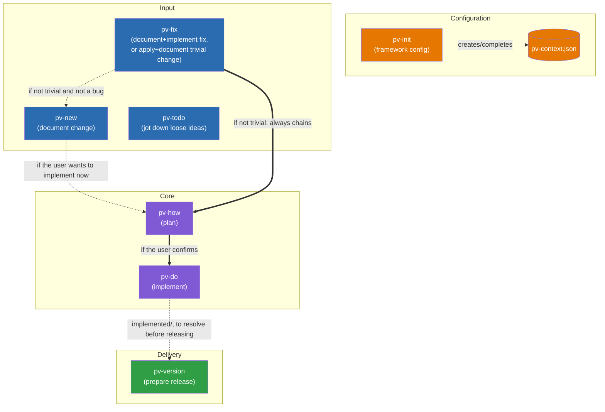

# Previo: Design documentation

Map of the skills that make up the `pv-*` framework and how they invoke each other.

## Table of contents

- [Relationship diagram](#relationship-diagram)
- [Responsibilities of each skill](#responsibilities-of-each-skill)
  - [User-invocable](#user-invocable)
  - [Internal and support](#internal-and-support)
- [The `pv-context.json` file](#the-pv-contextjson-file)
  - [skillModels](#skillmodels)
  - [framework](#framework)
- [The `pv.py` launcher](#the-pvpy-launcher)
- [Complete folder and file structure](#complete-folder-and-file-structure)

## Relationship diagram

Simplified diagram showing only the main user-visible flow. Internal skills (`pv-internal-workflow`, `pv-internal-tech-analysis`, `pv-internal-tech-security`, `pv-internal-tech-mermaid`, `pv-internal-tech-risks`, `pv-internal-mockups-html`, `pv-internal-mockups-ascii`, `pv-internal-doc-features`, `pv-internal-doc-technical`, `pv-internal-changelog`) and support skills (`pv-status`) don't appear here — their relationship to the rest is described in the responsibilities section below. The internal flow of `pv-version`/`pv-internal-changelog` (with guardrails and step-by-step detail) has its own diagram, not duplicated here: [`.claude/skills/pv-version/version-flow-diagram.template.md`](skills/pv-version/version-flow-diagram.template.md).

`pv-how` (plan) and `pv-do` (implement) are two separate skills: `pv-how` analyzes the technical solution and writes `plan.md`, and only if the user confirms they want to implement now does it chain into `pv-do`, which is the one that edits the code. `pv-do` can also be invoked directly on an entry that already has a `plan.md`, without going through `pv-how` again.



Legend:
- Solid arrows (`-->`, `==>`): direct skill-to-skill invocation within the same process.
- Dotted arrows (`-.->`): configuration dependency or conditional invocation.
- `pv-todo` has no arrow to the rest of the flow: it lives isolated in `{changesDir}/todo/`, unrelated to the rest of the skills.
- `pv-fix` is the only "Input" skill that can finish without going through `plan.md`: if the change (bug or not) truly qualifies as trivial, it creates the entry in `{changesDir}/inProgress/{xxxx}/` via `pv-internal-workflow` (normal `xxxx` numbering) and moves it to `implemented` in the same invocation, without generating `plan.md` or chaining `pv-how`/`pv-do`. It only falls back to `pv-new` when the analysis reveals it wasn't trivial and it's not a bug either (affects architecture/style, information is missing, touches more than 2 files, or is new functionality).
- `pv-version` doesn't consume `pv-do`'s output directly: it only requires, as a startup guardrail, that `{changesDir}/implemented/` be empty (each resolved entry moves to `closed` before continuing).
- All skills read `.claude/pv-context.json` to function, not just the ones shown here connected to it — that arrow is omitted for each one to avoid cluttering the diagram; `pv-init` is the only one that writes it.

## Responsibilities of each skill

### User-invocable

- **pv-init** — Initializes the framework: creates/completes `.claude/pv-context.json` (`framework.workFolder` — fixed at `/previo-sdd`, never asked, root relative to the repo under which the framework manages `changes/`, `versions/` and `stuff/`, fixed-name subfolders the skills create themselves —, docs to keep in sync, language configuration) and checks that the required command-line tools are installed. On a first `pv-init`, it always asks for the interaction language (`framework.interaction.language`) and, with a yes/no, whether the rest of the areas (`changes`, `versions`, `docs.functional`, `docs.tech`) share that same language or are configured one by one; it records the reason for each choice in `framework._comments`. If the project was already initialized without a language configured (`hasLanguage: false`), it adds that question to the same round that fills in the rest of the pending optional fields, without asking again if it was already resolved. The single configuration point all other skills depend on. *Uses:* no other skill.
- **pv-new** — Documents an intentional change (new functionality or a deliberate behavior modification, not a bug). Invokes `pv-internal-tech-analysis` to gather technical context before anticipating typical functional questions, generates `description.md` via `pv-internal-workflow` and, if applicable, functional Mermaid diagrams per use case (via `pv-internal-tech-mermaid`) and visual mockups `design_*.html` (via `pv-internal-mockups-html`, or the alternative configured in `framework.skills.mockups`), validating both with the user before considering the change documented. Doesn't implement anything itself, but if the user wants to implement right away it can invoke `pv-how` directly on the entry it just created. *Uses:* `pv-internal-workflow`, `pv-internal-tech-analysis`, `pv-internal-tech-mermaid`, `pv-internal-mockups-html`, `pv-how`.
- **pv-fix** — Documents a bug and implements it end to end, and is also the framework's fast lane for changes small enough to barely need analysis (typo, text, a value/constant, an isolated style tweak, bug or not). First invokes `pv-internal-tech-analysis` to assess whether the request is `fast` (unambiguous, ≤2 files, doesn't affect `docs.tech.architectureDocDir`/`docs.tech.styleBibleDocDir` and no inconsistencies detected with them, no new behavior). If it's `fast`, it creates the entry via `pv-internal-workflow` (`action=create`, `type=fast`), applies the change directly, and moves it to `implemented` (`action=move`) in the same invocation, without `plan.md`. If it's not `fast` and it is a bug, it generates `description.md` via `pv-internal-workflow` (`type=fix`), invoking `pv-internal-tech-mermaid`/`pv-internal-mockups-html` when the fix has a flow or visual component to represent, and automatically chains `pv-how` to fix it end to end, with the analysis strictly scoped to the root cause (no scope creep). If it's not `fast` and not a bug, it tells the user and invokes `pv-new` with their request. *Uses:* `pv-internal-workflow`, `pv-internal-tech-analysis`, `pv-internal-tech-mermaid`, `pv-internal-mockups-html`, `pv-new`, `pv-how`.
- **pv-how** — Takes an entry already documented in `inProgress`, invokes `pv-internal-tech-analysis` to gather technical context, analyzes the technical solution, and writes `plan.md` (using `pv-internal-tech-mermaid`/`pv-internal-mockups-html` when what needs describing is a flow or requires a visual mockup). With `plan.md` already written, it invokes `pv-internal-tech-risks` to assess the risk of breaking something by implementing it and writes the returned median in the plan's header (the detail of the 9 factors is only added if the user asks for it). If the user confirms they want to implement now, it chains directly into `pv-do` on the same entry. *Uses:* `pv-internal-tech-analysis`, `pv-internal-tech-mermaid`, `pv-internal-mockups-html`, `pv-internal-tech-risks`, `pv-do`.
- **pv-do** — Takes an entry from `inProgress` whose `plan.md` is already written (by `pv-how`, or invoked directly by the user), implements the code, updates the synced documentation (`docs.tech.architectureDocDir`/`docs.functional.featuresDocPathDir`/`docs.tech.styleBibleDocDir` — including any inconsistency `pv-internal-tech-analysis` reported via `pv-how`), and moves the folder to `implemented` via `pv-internal-workflow`. If `docs.functional.featuresDocPathDir` is a folder, it delegates its reading/writing to `pv-internal-doc-features` instead of touching it directly. Before drafting or editing `docs.tech.architectureDocDir`/`styleBibleDocDir` content, it invokes `pv-internal-doc-technical` to load its writing style (meant for an AI reader, not a human) and applies it while drafting. *Uses:* `pv-internal-workflow`, `pv-internal-doc-features`, `pv-internal-doc-technical`.
- **pv-status** — Gives a read-only overview of the project's status (totals by type — including `fast`, `pv-fix`'s trivial shortcut — and by state, detail on what's only described vs. ready to implement, and a separate listing of already-applied `fast` changes). Doesn't create, move, or modify anything; the report is delivered in chat unless the user asks to save it. *Uses:* no other skill.
- **pv-todo** — Notebook for loose ideas, deliberately outside the framework's workflow: it lives in `{changesDir}/todo/`, with its own numbering and identifiers that no other `pv-*` skill reads or counts. Used for jotting down incomplete ideas without forcing `pv-new`/`pv-fix`'s scope analysis. *Uses:* no other skill.
- **pv-version** — Prepares a release in `{workFolder}/versions/{XXXX}/`: first requires that `{changesDir}/implemented/` be empty (each entry is resolved by moving it to `closed`), generates the deliverable following `{workFolder}/stuff/how-to-compile-version.md` (project-specific procedure, written the first time it's needed, able to describe several steps if the build produces several artifacts), zips and copies whichever of `docs.tech.architectureDocDir`/`docs.tech.styleBibleDocDir`/`docs.functional.featuresDocPathDir` are configured, and chains `pv-internal-changelog` for the functional changelog. If invoked just to report a change in the build procedure, it updates `{workFolder}/stuff/how-to-compile-version.md` without launching the rest of the process unless explicitly confirmed. `{XXXX}` is free text chosen by the user on each invocation, unrelated to the `xxxx` numbering of changes/fixes or to any other "versions" folder that may exist in the repo. *Uses:* `pv-internal-changelog`.

### Internal and support

`pv-internal-workflow`, `pv-internal-tech-analysis`, `pv-internal-tech-security`, and `pv-internal-changelog` only run when another framework skill invokes them as part of its own process; if the user invokes them directly (or asks to "run X" in plain text outside that context), they stop without doing anything and redirect to the corresponding skill.

- **pv-internal-workflow** — Centralizes the framework's file mechanics: numbering and creating new entries in `inProgress` (`action=create`, with `type` `change`/`fix`/`fast`), and moving folders between states (`action=move`). Doesn't analyze or decide anything, only executes what the calling skill already resolved. For `pv-fix`'s `fast` shortcut, the caller typically chains `create` and `move` in the same invocation, without going through `plan.md`. *Uses:* no other skill.
- **pv-internal-tech-analysis** — Centralizes how to gather reliable technical context: first reads the configured `framework.docs.tech` documentation, and only explores code if more information is needed to complete the picture. If the topic touches an interface or data structure, it requires having its complete definition (signature, parameters, return, fields) before considering the context gathered, exploring code on a targeted basis if needed — and if a definition doubt remains that neither the documentation nor the code resolves, it confirms it directly with the user. If it detects inconsistencies between documentation and code, the code wins and the inconsistency is returned as a finding to the caller. When done, it invokes `pv-internal-tech-security` to check the change against its security checklist and adds the pending items to the result (it never edits anything itself). Used by `pv-new`, `pv-fix`, and `pv-how`. *Uses:* `pv-internal-tech-security`.
- **pv-internal-tech-security** — Checks a change/fix against a checklist of security categories (authentication, authorization, input validation/injection, secrets, transport, sensitive data, dependencies, infrastructure, API, logging, client-side hardening), based on the change summary and the context already gathered by the caller. For each applicable category, it distinguishes between those already covered by the available context and those left pending review. Doesn't explore code on its own initiative or decide design, only checks against the checklist. Used by `pv-internal-tech-analysis`. *Uses:* no other skill.
- **pv-internal-tech-mermaid** — Generates Mermaid diagrams (functional or technical: flow, sequence) representing a use case, user story, workflow, or communication between components, from the list of diagrams the caller needs (type and what each one should represent). Doesn't decide which diagrams are needed or where they're inserted, only writes the Mermaid code. It's the default diagram skill for `framework.skills.diagrams` — a project can swap it out for another as long as it honors the same input/output contract. Used by `pv-internal-workflow`, `pv-new`, `pv-fix`, and `pv-how`. *Uses:* no other skill.
- **pv-internal-tech-risks** — Assesses the risk of breaking something when implementing the technical solution already written in a change/fix's `plan.md`: scores 9 factors (shared usage, scope, depth, test coverage, criticality, reversibility, persistent data, security surface, sensitive data) from 0 to 10, exploring `sourcecodeDir` on a targeted basis when `plan.md`/`description.md` alone aren't enough to score one, and returns the `factor=value` list plus the median. Only invoked once `plan.md` is already written — before that there isn't enough information. Doesn't write anything; the caller decides what to persist. Used by `pv-how`. *Uses:* no other skill.
- **pv-internal-mockups-html** — Generates or edits static visual mockups in self-contained HTML/CSS/SVG (`design_*.html`) for a new or modified UI element, from the destination folder and the list of elements the caller needs mocked up. Doesn't decide which elements are needed or validate anything with the user, only produces the files and returns their paths. It's the default mockup skill for `framework.skills.mockups`. Used by `pv-new` and `pv-fix`. *Uses:* no other skill.
- **pv-internal-mockups-ascii** — Same function and same input/output contract as `pv-internal-mockups-html`, but generating the mockups as plain-text ASCII art (`design_*.txt`) instead of HTML. Only invoked when a project configures `framework.skills.mockups` to use this alternative instead of the default. *Uses:* no other skill.
- **pv-internal-doc-features** — Centralizes the organization of `docs.functional.featuresDocPathDir` when it's a folder (one file per feature + a generated `INDEX.md`): `find` locates whether a feature already has its own file, `upsert` writes the final file (already drafted by the caller) and regenerates the index. Doesn't decide what the documentation says, only where and how it's stored. Used by `pv-do`. *Uses:* no other skill.
- **pv-internal-doc-technical** — Writing style (not a template) for `docs.tech.architectureDocDir`/`styleBibleDocDir`: dense fact fragments meant for an AI reader (`pv-internal-tech-analysis` and, later, `pv-do`/`pv-how`), not prose for a human — code for signatures/types, tables for parallel structures, no narrative or summaries, fixed English tags for recurring properties. Doesn't decide each document's topic or structure, nor writes anything itself: only loads the rules before the caller drafts. Used by `pv-do`. *Uses:* no other skill.
- **pv-internal-changelog** — Writes `changelog.md` for a release from the entries accumulated in `{changesDir}/closed/`: `fix`-type entries go straight to the Fixes section, and the rest are classified by comparing against the `changelog.md` of the previous version in `{workFolder}/versions/` (if it exists) into New/Changed/Removed. Adds a header with the entry count per section and deletes the incorporated folders from `closed/` after the user's explicit confirmation. Used by `pv-version`. *Uses:* no other skill.

## The `pv-context.json` file

Example of an already-configured `.claude/pv-context.json`:

```json
{
  "skillModels": {
    "_instructions": "After editing 'default' or 'overrides' in this section, run from the repo root: python .claude/skills/pv-init/scripts/sync-skill-models.py -- it rewrites the 'model'/'effort' field in each 'pv-*' SKILL.md's frontmatter to match what's configured here. The Claude Code harness only reads that frontmatter, not this JSON, so without running the script the changes here have no effect.",
    "default": { "model": "claude-sonnet-5", "effort": "medium" },
    "overrides": {
      "pv-status": { "model": "claude-haiku-4-5-20251001", "effort": "medium" },
      "pv-todo": { "model": "claude-haiku-4-5-20251001", "effort": "medium" },
      "pv-do": { "model": "claude-haiku-4-5-20251001", "effort": "high" }
    }
  },
  "framework": {
    "skills": {
      "mockups": "pv-internal-mockups-html",
      "diagrams": "pv-internal-tech-mermaid"
    },
    "sourcecodeDir": "/src",
    "workFolder": "/previo-sdd",
    "numberWidth": 5,
    "interaction": { "language": "en" },
    "changes": { "language": "es" },
    "versions": { "language": "es" },
    "docs": {
      "functional": {
        "featuresDocPathDir": "docs/features",
        "language": "es"
      },
      "tech": {
        "architectureDocDir": "docs/architecture",
        "styleBibleDocDir": "docs/style",
        "language": "en"
      }
    },
    "_comments": {
      "interaction.language": "The team talks to Claude in English.",
      "changes.language": "Each in-progress change/fix is documented in Spanish, the team's language.",
      "versions.language": "The published changelog is written in Spanish.",
      "docs.functional.language": "Feature documentation in Spanish.",
      "docs.tech.language": "Architecture and style bible in English, to share with external collaborators."
    }
  }
}
```

`.claude/pv-context.json` is the framework's single configuration point: what makes the `pv-*` skills generic instead of tied to a specific project. Its shape is defined in [`.claude/skills/pv-init/schema.json`](skills/pv-init/schema.json) (JSON Schema, `additionalProperties: false` at every level — any field outside the schema is an error).

Only `pv-init` writes it: it creates the file the first time and, on later invocations, merges onto what's already there without overwriting anything the user has already configured. All other skills only read it; if they need a field that's missing, the instruction is to ask the user to run/complete `pv-init`, never to reimplement that bootstrap on their own or assume a default value not documented in the schema.

It has two top-level keys: `skillModels` (optional) and `framework` (required).

### skillModels

Declarative source of truth for the Claude model/effort each `pv-*` skill runs with. It has no effect on its own: the Claude Code harness only reads the `model`/`effort` field from each `SKILL.md`'s frontmatter, not this JSON. After editing `default` or `overrides` you need to run `.claude/skills/pv-init/scripts/sync-skill-models.py` (or the equivalent option in `pv.py`'s menu), which rewrites that frontmatter according to what's configured here — it's a deterministic script, no model invoked.

- **`_instructions`** (`string`): reminder embedded in the file itself of how to apply changes to `default`/`overrides`. No skill should delete this key.
- **`default`** (`modelConfig`): model/effort applied to any `pv-*` skill without its own entry in `overrides`.
- **`overrides`** (`object`, optional): one `modelConfig` per skill name (the `name:` from its `SKILL.md`, e.g. `pv-status`) for those that need something different from `default`.

Where `modelConfig` is `{ "model": string, "effort": string }` — `model` accepts the same IDs as `/model` (e.g. `claude-sonnet-5`, `claude-haiku-4-5-20251001`, or `inherit`); `effort` accepts the same values as the frontmatter (`low`/`medium`/`high`).

### framework

Fixed-shape configuration that the `pv-*` skills use directly, split into four blocks: the basics, configuration of interchangeable skills, language configuration, and external reference documentation.

#### The basics

- **`workFolder`** (`string`, optional, default `"/previo-sdd"`): folder relative to the repo root under which the framework manages all its work. The leading `/` is only a visual convention (so it stands out at a glance from `docs.*`, which is relative to `workFolder` itself) — it's optional and every `pv-*` script strips it before resolving, so `"previo-sdd"` and `"/previo-sdd"` behave identically; it's never a real filesystem-absolute path. It's the only `framework` field `pv-init` never asks or confirms: it always writes the default silently, same as `skills.mockups`/`skills.diagrams`. If a different folder is ever wanted, it's changed by hand in `pv-context.json`, at the risk of whoever edits it. Inside it, `pv-init`'s `scaffold-project.py` creates three fixed-name subfolders right after `pv-context.json` is written, that the user doesn't choose or rename:
  - `{workFolder}/changes/` — with `inProgress/` (documented, pending planning/implementation), `implemented/` (plan already implemented, pending release — `pv-do` moves it here), `todo/` (loose ideas from `pv-todo`, unrelated to the change/fix flow), and `closed/` (already incorporated into a release, managed by `pv-version`/`pv-internal-changelog`). A given `{xxxx}` never repeats between `inProgress`/`implemented`.
  - `{workFolder}/versions/` — one subfolder per release prepared with `pv-version`, with a free-text `XXXX` code chosen by the user on each invocation; a numbering space completely independent from `changes/`'s `{xxxx}`.
  - `{workFolder}/stuff/` — the project's own files that no other framework skill decides on its behalf, starting with `how-to-compile-version.md` (build procedure `pv-version` asks about and writes the first time it's needed).
- **`sourcecodeDir`** (`string`, optional, default `"/src"`): the project's source code root folder, relative to the repo root — with a leading `/` so it stands out at a glance from `docs.*`, which is relative to `workFolder`. Same convention as `workFolder`: that leading `/` is optional and cosmetic, never a real absolute path — `"src"` and `"/src"` resolve identically. Used by `pv-how` as fallback context when writing `plan.md`, only when `docs.tech.architectureDocDir` doesn't exist as a real folder in the repo.
- **`numberWidth`** (`integer`, optional, default `4`, minimum `1`): number of digits of the sequential `xxxx` code, zero-padded.

#### Skill configuration

- **`skills`** (`object`, optional): interchangeable skill names that the rest of the framework invokes by name instead of having them hardcoded in the code of whoever needs them — replacing the value here is enough to switch technology without touching `pv-new`/`pv-fix`/`pv-how`/`pv-internal-workflow`, as long as the indicated skill honors the same input/output contract as the one it replaces:
  - **`mockups`** (`string`, default `"pv-internal-mockups-html"`): the skill `pv-new`/`pv-fix` invoke for a change/fix's `design_*.html` mockups. Contract: destination folder + list of elements to create/edit as input; paths of the resulting files as output.
  - **`diagrams`** (`string`, default `"pv-internal-tech-mermaid"`): the skill `pv-internal-workflow`/`pv-new`/`pv-fix`/`pv-how` invoke for Mermaid diagrams. Contract: list of diagrams to generate (type + what each one represents) as input; each diagram's code as output.

#### Language configuration

Every writing point of the framework can have its own language instead of a single global one. `pv-init` asks about this configuration the first time it initializes the project (see its entry above); the rest of the skills only read it.

- **`interaction.language`** (`string`, optional, default `"en"`): the language `pv-*` skills use to talk to the user in chat (questions, confirmations, summaries). It's also the fallback value for `changes.language`, `versions.language`, and any `docs.*.language` that isn't configured separately. Free text or an ISO 639-1 code (e.g. `"es"`, `"fr"`).
- **`changes.language`** (`string`, optional, default `interaction.language`): language of an in-progress change/fix's documents (`description.md`, `plan.md`, `history.md`, and the sample text in `design_*.html`/`.txt` mockups) inside `{workFolder}/changes/**`.
- **`versions.language`** (`string`, optional, default `interaction.language`): language of `changelog.md`, generated by `pv-internal-changelog` in `{workFolder}/versions/{XXXX}/` from `changes/closed`.
- **`docs.functional.language`** (`string`, optional, default `interaction.language`): language of `docs.functional.featuresDocPathDir` (see "Documentation" below), which `pv-do` keeps updated after every implemented change/fix.
- **`docs.tech.language`** (`string`, optional, default `interaction.language`): language shared by `docs.tech.architectureDocDir` and `docs.tech.styleBibleDocDir` (see "Documentation" below), which `pv-do` keeps updated after every implemented change/fix — doesn't apply to the fixed English tags `pv-internal-doc-technical` requires for recurring properties, which always stay in English.
- **`_comments`** (`object`, optional): informational metadata for whoever edits the JSON by hand — for example, why each language was chosen. Ignored at runtime by all skills, same pattern as `skillModels._instructions`. `pv-init` fills it in alongside each `language` it writes.

#### Documentation

- **`docs`** (`object`, optional): external reference documentation for the project, grouped by area. All three paths are relative to `workFolder` (not the repo root) — the only field in `pv-context.json` relative to the repo root instead is `sourcecodeDir`:
  - **`functional.featuresDocPathDir`** (`string`, optional): listing of already-implemented functionality. Can be a folder (recommended — one file per feature plus a generated `INDEX.md`, in which case `pv-do` delegates reading/writing to `pv-internal-doc-features`) or, in projects not yet migrated, a single `.md` file. `pv-do` adds/updates the corresponding entry when implementing each change/fix, creating the path if it doesn't exist. If not configured, that step is skipped without asking. Its language is configured in `functional.language` (see "Language configuration" above).
  - **`tech.architectureDocDir`** (`string`, optional): folder with the architecture/technical design document, split into several files with an `INDEX.md` summarizing each one (2-digit numeric prefix, e.g. `01-`, `02-`). `pv-do` keeps it in sync after every change/fix, creating a new file with the next free number if the topic doesn't fit any existing one. Before drafting or editing its content, `pv-do` invokes `pv-internal-doc-technical` to apply its writing style.
  - **`tech.styleBibleDocDir`** (`string`, optional): same convention as `architectureDocDir`, but for the project's style guide (visual, interaction, writing).
  - The language shared by both `tech.*` fields is configured in `tech.language` (see "Language configuration" above).

Any `docs` field that isn't configured means the corresponding step is skipped without asking anything — the framework works the same either way, just with less context when analyzing and without keeping that documentation in sync.

## The `pv.py` launcher

Self-contained Python script meant for anyone who wants to check or close framework changes directly from a terminal, without going through Claude Code. Full design (screens, navigation flow, dependencies) in [`pv-design-onescript.en.md`](pv-design-onescript.en.md).

## Complete folder and file structure

Complete view of what the framework creates and where, using the default configuration (`workFolder` fixed at `/previo-sdd`, `docs.*` under `{workFolder}/docs/...`). Everything under `{workFolder}` (`changes/`, `versions/`, `stuff/`) has a fixed name — no skill asks about it or lets the user choose it; the only configurable pieces are `workFolder` itself (by hand, in `pv-context.json`, without going through `pv-init`) and the `docs.*` paths inside it. `sourcecodeDir` is the only path in `pv-context.json` relative to the repo root instead of to `workFolder`.

```
{repo root}/
├── pv.py                              # framework launcher (copied/updated by pv-init)
├── src/                               # sourcecodeDir (default "/src") — only path relative to the repo root
├── .claude/
│   ├── pv-context.json                # single configuration point (written by pv-init)
│   ├── pv-design.{es,en}.md           # this document
│   ├── pv-guide.{es,en}.md            # usage guide
│   └── skills/
│       ├── pv-init/                   # initializes/completes pv-context.json
│       ├── pv-new/                    # documents a change
│       ├── pv-fix/                    # documents+implements a fix (or fast shortcut)
│       ├── pv-how/                    # plans: writes plan.md
│       ├── pv-do/                     # implements the code
│       ├── pv-status/                 # read-only status view
│       ├── pv-todo/                   # loose ideas, outside the flow
│       ├── pv-version/                # prepares a release
│       │   └── how-to-compile-version.template.md  # template pv-version copies when writing stuff/how-to-compile-version.md
│       └── pv-internal-*/             # internal skills, invoked by the ones above
│
└── previo-sdd/                        # {workFolder} — fixed default, never asked about
    ├── changes/                       # fixed name
    │   ├── inProgress/                # documented, pending planning/implementation
    │   │   └── {xxxx}/                # e.g. 00007 (numbered, numberWidth digits)
    │   │       ├── description.md     # functional summary (pv-new/pv-fix, via pv-internal-workflow)
    │   │       ├── history.md         # original prompt verbatim, exclusive to pv-new/pv-fix
    │   │       ├── plan.md            # technical solution, only after pv-how
    │   │       └── design_*.html      # visual mockups, if the change has a UI component
    │   ├── implemented/               # same content as inProgress, moved by pv-do
    │   │   └── {xxxx}/                # folder moved as-is from inProgress/{xxxx}
    │   ├── todo/                      # notes from pv-todo, own numbering
    │   │   └── {code}/                # e.g. a3f9k (5 alphanumeric characters)
    │   │       ├── description.md     # idea jotted down as-is, no scope analysis
    │   │       └── design_*.html      # optional mockup, only if the user provides one
    │   └── closed/                    # already incorporated into a release
    │       └── {xxxx}/                # deleted after pv-internal-changelog + user confirmation
    │
    ├── versions/                      # fixed name
    │   └── {XXXX}/                    # free text chosen by the user, e.g. v1.2
    │       ├── files/                 # generated deliverable(s), copied by script
    │       ├── docs/                  # .zip of docs.tech.*/docs.functional.* current at this release
    │       └── changelog.md           # written by pv-internal-changelog from changes/closed/
    │
    ├── stuff/                         # fixed name — the project's own files
    │   └── how-to-compile-version.md  # build procedure, written by pv-version (lazily created)
    │
    └── docs/                          # docs.* — configurable paths (relative to workFolder), kept in sync by pv-do
        ├── architecture/              # docs.tech.architectureDocDir
        │   ├── INDEX.md                 # generated index, summarizes each sibling file
        │   └── 01-overview.md, 02-...   # actual content, 2-digit numeric prefix per topic
        ├── style/                     # docs.tech.styleBibleDocDir
        │   ├── INDEX.md                 # same pattern as architecture/INDEX.md
        │   └── 01-overview.md, 02-...   # same pattern as architecture/
        └── features/                  # docs.functional.featuresDocPathDir
            ├── INDEX.md                 # index generated by pv-internal-doc-features
            └── {feature}.md              # one file per already-implemented feature
```

Notes:
- `{xxxx}` (`changes/` numbering) and `{XXXX}` (`versions/` numbering) are completely independent numbering spaces from each other and from `todo/`'s `{code}`.
- `stuff/how-to-compile-version.md` is created lazily: it doesn't exist until `pv-version` needs it for the first time (or until a build-procedure change is reported without requesting a release).
- `docs/` is the default path `pv-init` proposes/generates for the three `docs` fields, inside `workFolder`; any of the three can point to a different path (always relative to `workFolder`), or not exist if the user decides not to maintain it. Don't confuse it with `versions/{XXXX}/docs/`, which is just this folder's `.zip` at the time of each release.
- `sourcecodeDir` (default `"/src"`) is the only field in `pv-context.json` relative to the repo root instead of to `workFolder` — the project's source code isn't managed by the framework. The leading `/` is the visual convention distinguishing it from `docs.*`, which is relative to `workFolder`.
