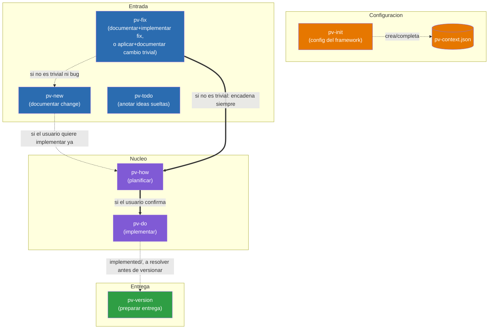

# Previo: Documentación de diseño

Mapa de las skills que componen el framework `pv-*` y cómo se invocan entre sí.

## Índice

- [Diagrama de relaciones](#diagrama-de-relaciones)
- [Responsabilidades de cada skill](#responsabilidades-de-cada-skill)
  - [Invocables por el usuario](#invocables-por-el-usuario)
  - [Internas y de soporte](#internas-y-de-soporte)
- [El fichero `pv-context.json`](#el-fichero-pv-contextjson)
  - [`skillModels` (opcional)](#skillmodels-opcional)
  - [`framework` (obligatorio)](#framework-obligatorio)

## Diagrama de relaciones

Diagrama simplificado con solo el flujo principal visible al usuario. Las skills internas (`pv-internal-workflow`, `pv-internal-tech-analysis`, `pv-internal-tech-mermaid`, `pv-internal-tech-risks`, `pv-internal-mockups-html`, `pv-internal-mockups-ascii`, `pv-internal-doc-features`, `pv-internal-changelog`) y de soporte (`pv-status`) no aparecen aquí — su relación con el resto está descrita en la sección de responsabilidades más abajo. El flujo interno de `pv-version`/`pv-internal-changelog` (con guardarraíles y detalle paso a paso) tiene su propio diagrama, no duplicado aquí: [`.claude/skills/pv-version/version-flow-diagram.template.md`](skills/pv-version/version-flow-diagram.template.md).

`pv-how` (planificar) y `pv-do` (implementar) son dos skills separadas: `pv-how` analiza la solución técnica y escribe `plan.md`, y solo si el usuario confirma que quiere implementar ya, encadena `pv-do`, que es quien edita el código. También se puede invocar `pv-do` directamente sobre una entrada que ya tenga `plan.md`, sin pasar por `pv-how` de nuevo.



Leyenda:
- Flechas sólidas (`-->`, `==>`): invocación directa de skill a skill dentro del mismo proceso.
- Flechas punteadas (`-.->`): dependencia de configuración o invocación condicional.
- `pv-todo` no tiene ninguna flecha hacia el resto del flujo: vive aislado en `{changesDir}/todo/`, ajeno al resto de skills.
- `pv-fix` es la única skill de "Entrada" que puede terminar sin pasar por `plan.md`: si el cambio (bug o no) de verdad califica como trivial, crea la entrada en `{changesDir}/inProgress/{xxxx}/` vía `pv-internal-workflow` (numeración `xxxx` normal) y la mueve a `implemented` en la misma invocación, sin generar `plan.md` ni encadenar `pv-how`/`pv-do`. Solo cae en `pv-new` cuando el análisis revela que no era trivial y tampoco es un bug (afecta a arquitectura/estilo, falta información, toca más de 2 ficheros, o es funcionalidad nueva).
- `pv-version` no consume la salida de `pv-do` directamente: solo exige, como guardarraíl de arranque, que `{changesDir}/implemented/` esté vacío (cada entrada resuelta se mueve a `closed` antes de continuar).
- Todas las skills leen `.claude/pv-context.json` para funcionar, no solo las que aparecen aquí conectadas a él — se omite esa flecha hacia cada una para no saturar el diagrama; `pv-init` es la única que lo escribe.

## Responsabilidades de cada skill

### Invocables por el usuario

- **pv-init** — Inicializa el framework: crea/completa `.claude/pv-context.json` (`framework.workFolder` — raíz relativa al repo bajo la que el framework gestiona `changes/` y `versions/`, subcarpetas de nombre fijo que las skills crean por sí mismas —, docs a sincronizar) y comprueba que las herramientas de línea de comandos necesarias estén instaladas. Único punto de configuración del que dependen todas las demás skills. *Usa:* ninguna otra skill.
- **pv-new** — Documenta un cambio intencionado (funcionalidad nueva o modificación de comportamiento a propósito, no un bug). Invoca `pv-internal-tech-analysis` para reunir contexto técnico antes de anticipar dudas funcionales típicas, genera `description.md` vía `pv-internal-workflow` y, si aplica, diagramas Mermaid funcionales por caso de uso (vía `pv-internal-tech-mermaid`) y maquetas visuales `design_*.html` (vía `pv-internal-mockups-html`, o la alternativa configurada en `framework.skills.mockups`), validando ambos con el usuario antes de dar el cambio por documentado. No implementa nada por sí misma, pero si el usuario quiere implementar de inmediato puede invocar directamente `pv-how` sobre la entrada recién creada. *Usa:* `pv-internal-workflow`, `pv-internal-tech-analysis`, `pv-internal-tech-mermaid`, `pv-internal-mockups-html`, `pv-how`.
- **pv-fix** — Documenta un bug y lo implementa de punta a punta, y además es la vía rápida del framework para cambios tan pequeños que casi no requieren análisis (typo, texto, un valor/constante, un ajuste de estilo aislado, sea o no un bug). Primero invoca `pv-internal-tech-analysis` para valorar si lo pedido es `fast` (sin ambigüedad, ≤2 ficheros, sin afectar a `docs.tech.architectureDocDir`/`docs.tech.styleBibleDocDir` ni incongruencias detectadas con ellos, sin comportamiento nuevo). Si es `fast`, crea la entrada vía `pv-internal-workflow` (`action=create`, `type=fast`), aplica el cambio directamente y la mueve a `implemented` (`action=move`) en la misma invocación, sin `plan.md`. Si no es `fast` y es un bug, genera `description.md` vía `pv-internal-workflow` (`type=fix`), invocando `pv-internal-tech-mermaid`/`pv-internal-mockups-html` cuando el fix tiene flujo o componente visual que representar, y encadena automáticamente `pv-how` para corregirlo de punta a punta, con el análisis acotado estrictamente a la causa raíz (sin ampliar alcance). Si no es `fast` y no es un bug, avisa al usuario e invoca `pv-new` con su petición. *Usa:* `pv-internal-workflow`, `pv-internal-tech-analysis`, `pv-internal-tech-mermaid`, `pv-internal-mockups-html`, `pv-new`, `pv-how`.
- **pv-how** — Toma una entrada ya documentada en `inProgress`, invoca `pv-internal-tech-analysis` para reunir el contexto técnico, analiza la solución técnica y escribe `plan.md` (usando `pv-internal-tech-mermaid`/`pv-internal-mockups-html` cuando lo que hay que describir es un flujo o requiere maqueta visual). Con `plan.md` ya escrito, invoca `pv-internal-tech-risks` para valorar el riesgo de romper algo al implementarlo y escribe la mediana devuelta en la cabecera del plan (el detalle de los 9 factores solo se añade si el usuario lo pide). Si el usuario confirma que quiere implementar ya, encadena directamente `pv-do` sobre la misma entrada. *Usa:* `pv-internal-tech-analysis`, `pv-internal-tech-mermaid`, `pv-internal-mockups-html`, `pv-internal-tech-risks`, `pv-do`.
- **pv-do** — Toma una entrada de `inProgress` cuyo `plan.md` ya está escrito (por `pv-how`, o invocada directamente por el usuario), implementa el código, actualiza la documentación sincronizada (`docs.tech.architectureDocDir`/`docs.functional.featuresDocPathDir`/`docs.tech.styleBibleDocDir` — incluyendo cualquier incongruencia que `pv-internal-tech-analysis` haya reportado vía `pv-how`) y mueve la carpeta a `implemented` vía `pv-internal-workflow`. Si `docs.functional.featuresDocPathDir` es una carpeta, delega su lectura/escritura en `pv-internal-doc-features` en vez de tocarla directamente. *Usa:* `pv-internal-workflow`, `pv-internal-doc-features`.
- **pv-status** — Da una vista general de solo lectura del estado del proyecto (totales por tipo —incluido `fast`, el atajo trivial de `pv-fix`— y por estado, detalle de qué está solo descrito vs. listo para implementar, y listado aparte de los cambios `fast` ya aplicados). No crea, mueve ni modifica nada; el informe se entrega en el chat salvo que el usuario pida guardarlo. *Usa:* ninguna otra skill.
- **pv-todo** — Cuaderno de ideas sueltas, deliberadamente fuera del flujo de trabajo del framework: vive en `{changesDir}/todo/`, con numeración e identificadores propios que ninguna otra skill `pv-*` lee ni cuenta. Sirve para anotar ideas incompletas sin forzar el análisis de alcance de `pv-new`/`pv-fix`. *Usa:* ninguna otra skill.
- **pv-version** — Prepara una entrega en `{workFolder}/versions/{XXXX}/`: exige primero que `{changesDir}/implemented/` esté vacío (cada entrada se resuelve moviéndola a `closed`), genera el entregable siguiendo `{workFolder}/framework/how-to-compile-version.md` (procedimiento propio del proyecto, escrito la primera vez que hace falta, capaz de describir varios pasos si el build genera varios artefactos), comprime en `.zip` y copia `docs.tech.architectureDocDir`/`docs.tech.styleBibleDocDir`/`docs.functional.featuresDocPathDir` que estén configuradas, y encadena `pv-internal-changelog` para el changelog funcional. Si se invoca solo para informar de un cambio en el procedimiento de build, actualiza `{workFolder}/framework/how-to-compile-version.md` sin lanzar el resto del proceso salvo confirmación explícita. `{XXXX}` es texto libre elegido por el usuario en cada invocación, sin relación con la numeración `xxxx` de change/fix ni con ninguna otra carpeta "versions" que exista en el repo. *Usa:* `pv-internal-changelog`.

### Internas y de soporte

`pv-internal-workflow`, `pv-internal-tech-analysis` y `pv-internal-changelog` solo se ejecutan cuando otra skill del framework las invoca como parte de su propio proceso; si el usuario las invoca directamente (o pide "ejecuta X" en texto plano sin venir de ese contexto), se detienen sin hacer nada y redirigen a la skill correspondiente.

- **pv-internal-workflow** — Centraliza la mecánica de fichero del framework: numerar y crear entradas nuevas en `inProgress` (`action=create`, con `type` `change`/`fix`/`fast`), y mover carpetas entre estados (`action=move`). No analiza ni decide nada, solo ejecuta lo que la skill llamante ya resolvió. Para el atajo `fast` de `pv-fix`, quien invoca típicamente encadena `create` y `move` en la misma invocación, sin pasar por `plan.md`. *Usa:* ninguna otra skill.
- **pv-internal-tech-analysis** — Centraliza cómo reunir contexto técnico fiable: lee primero la documentación de `framework.docs.tech` configurada, y solo explora código si hace falta completar información. Si detecta incongruencias entre documentación y código, el código manda y la incongruencia se devuelve como hallazgo a quien invoca (nunca edita nada ella misma). La usan `pv-new`, `pv-fix` e `pv-how`. *Usa:* ninguna otra skill.
- **pv-internal-tech-mermaid** — Genera diagramas Mermaid (funcionales o técnicos: flujo, secuencia) que representan un caso de uso, historia de usuario, flujo de trabajo o comunicación entre componentes, a partir de la lista de diagramas que quien invoca necesita (tipo y qué debe representar cada uno). No decide qué diagramas hacen falta ni dónde se insertan, solo redacta el código Mermaid. Es la skill de diagramas por defecto de `framework.skills.diagrams` — un proyecto puede sustituirla por otra siempre que cumpla el mismo contrato de entrada/salida. La usan `pv-internal-workflow`, `pv-new`, `pv-fix` y `pv-how`. *Usa:* ninguna otra skill.
- **pv-internal-tech-risks** — Valora el riesgo de romper algo al implementar la solución técnica ya escrita en `plan.md` de un change/fix: puntúa 9 factores (uso compartido, alcance, profundidad, cobertura de tests, criticidad, reversibilidad, datos persistentes, superficie de seguridad, datos sensibles) de 0 a 10, explorando `sourcecodeDir` puntualmente si `plan.md`/`description.md` no bastan para valorar alguno, y devuelve la lista `factor=valor` más la mediana. Solo se invoca cuando `plan.md` ya está escrito — antes no hay información suficiente. No escribe nada; quien invoca decide qué persistir. La usa `pv-how`. *Usa:* ninguna otra skill.
- **pv-internal-mockups-html** — Genera o edita maquetas visuales estáticas en HTML/CSS/SVG autocontenido (`design_*.html`) de un elemento de UI nuevo o modificado, a partir de la carpeta destino y la lista de elementos que quien invoca necesita maquetar. No decide qué elementos hacen falta ni valida nada con el usuario, solo produce los ficheros y devuelve sus rutas. Es la skill de maquetas por defecto de `framework.skills.mockups`. La usan `pv-new` y `pv-fix`. *Usa:* ninguna otra skill.
- **pv-internal-mockups-ascii** — Misma función y mismo contrato de entrada/salida que `pv-internal-mockups-html`, pero generando las maquetas como arte ASCII en texto plano (`design_*.txt`) en vez de HTML. Solo se invoca cuando un proyecto configura `framework.skills.mockups` para usar esta alternativa en lugar de la de por defecto. *Usa:* ninguna otra skill.
- **pv-internal-doc-features** — Centraliza la organización de `docs.functional.featuresDocPathDir` cuando es una carpeta (un fichero por funcionalidad + `INDEX.md` generado): `find` localiza si una funcionalidad ya tiene fichero propio, `upsert` escribe el fichero final (ya redactado por quien invoca) y regenera el índice. No decide qué dice la documentación, solo dónde y cómo se guarda. La usa `pv-do`. *Usa:* ninguna otra skill.
- **pv-internal-changelog** — Redacta `changelog.md` de una entrega a partir de las entradas acumuladas en `{changesDir}/closed/`: las de tipo `fix` van directas a la sección Fixes, y el resto se clasifica comparando contra el `changelog.md` de la versión anterior en `{workFolder}/versions/` (si existe) en Nuevo/Cambios/Eliminado. Añade una cabecera con el número de entradas de cada sección y borra las carpetas incorporadas de `closed/` tras confirmación explícita del usuario. La usa `pv-version`. *Usa:* ninguna otra skill.

## El fichero `pv-context.json`

Ejemplo de `.claude/pv-context.json` ya configurado:

```json
{
  "skillModels": {
    "_instructions": "Tras editar 'default' o 'overrides' de esta seccion, ejecuta desde la raiz del repo: python .claude/skills/pv-init/scripts/sync-skill-models.py -- reescribe el campo 'model'/'effort' en el frontmatter de cada SKILL.md 'pv-*' segun lo que quede configurado aqui. El harness de Claude Code solo lee ese frontmatter, no este JSON, asi que sin ejecutar el script los cambios de aqui no tienen efecto.",
    "default": { "model": "claude-sonnet-5", "effort": "medium" },
    "overrides": {
      "pv-status": { "model": "claude-haiku-4-5-20251001", "effort": "medium" },
      "pv-todo": { "model": "claude-haiku-4-5-20251001", "effort": "medium" },
      "pv-do": { "model": "claude-haiku-4-5-20251001", "effort": "high" }
    }
  },
  "framework": {
    "skills": {
      "mockups": "pv-internal-mockups-html",
      "diagrams": "pv-internal-tech-mermaid"
    },
    "sourcecodeDir": "src",
    "workFolder": "/",
    "numberWidth": 5,
    "docs": {
      "functional": {
        "featuresDocPathDir": "design/docs/features"
      },
      "tech": {
        "architectureDocDir": "design/docs/architecture",
        "styleBibleDocDir": "design/docs/style"
      }
    }
  }
}
```

`.claude/pv-context.json` es el único punto de configuración del framework: lo que hace que las skills `pv-*` sean genéricas en vez de estar atadas a un proyecto concreto. Su forma está definida en [`.claude/skills/pv-init/schema.json`](skills/pv-init/schema.json) (JSON Schema, `additionalProperties: false` en cada nivel — cualquier campo fuera del schema es un error).

Solo lo escribe `pv-init`: crea el fichero la primera vez y, en invocaciones posteriores, hace *merge* sobre lo ya existente sin pisar nada que el usuario ya haya configurado. El resto de skills solo lo leen; si necesitan un campo que falta, la instrucción es pedirle al usuario que ejecute/complete `pv-init`, nunca reimplementar ese bootstrap por su cuenta ni asumir un valor por defecto no documentado en el schema.

Tiene dos claves de primer nivel: `skillModels` (opcional) y `framework` (obligatoria).

### `skillModels` (opcional)

Fuente de verdad declarativa para el modelo/esfuerzo de Claude con el que corre cada skill `pv-*`. No tiene efecto por sí sola: el harness de Claude Code solo lee el campo `model`/`effort` del frontmatter de cada `SKILL.md`, no este JSON. Tras editar `default` u `overrides` hay que ejecutar `.claude/skills/pv-init/scripts/sync-skill-models.py` (o la opción equivalente del menú de `pv.py`), que reescribe ese frontmatter según lo configurado aquí — es un script determinista, sin invocar ningún modelo.

- **`_instructions`** (`string`): recordatorio embebido en el propio fichero de cómo aplicar cambios de `default`/`overrides`. Ninguna skill debe borrar esta clave.
- **`default`** (`modelConfig`): modelo/esfuerzo que aplica a cualquier skill `pv-*` sin entrada propia en `overrides`.
- **`overrides`** (`object`, opcional): un `modelConfig` por nombre de skill (el `name:` de su `SKILL.md`, p.ej. `pv-status`) para las que necesiten algo distinto del `default`.

Donde `modelConfig` es `{ "model": string, "effort": string }` — `model` acepta los mismos IDs que `/model` (p.ej. `claude-sonnet-5`, `claude-haiku-4-5-20251001`, o `inherit`); `effort` acepta los mismos valores que el frontmatter (`low`/`medium`/`high`).

### `framework` (obligatorio)

Configuración de forma fija que las skills `pv-*` usan directamente.

- **`workFolder`** (`string`, opcional, default `"/"`): carpeta relativa a la raíz del repo bajo la que el framework gestiona todo su trabajo. Dentro de ella, las skills crean por sí mismas dos subcarpetas de nombre fijo que el usuario no elige ni renombra:
  - `{workFolder}/changes/` — con `inProgress/` (documentado, pendiente de planificar/implementar), `implemented/` (plan ya implementado, pendiente de entrega — lo mueve ahí `pv-do`), `todo/` (ideas sueltas de `pv-todo`, ajenas al flujo de change/fix) y `closed/` (ya incorporado a una entrega, gestionado por `pv-version`/`pv-internal-changelog`). Un mismo `{xxxx}` nunca se repite entre `inProgress`/`implemented`.
  - `{workFolder}/versions/` — una subcarpeta por entrega preparada con `pv-version`, con código `XXXX` de texto libre elegido por el usuario en cada invocación; espacio de numeración totalmente independiente del `{xxxx}` de `changes/`.
- **`sourcecodeDir`** (`string`, opcional): carpeta raíz del código fuente del proyecto. La usa `pv-how` como contexto de respaldo al escribir `plan.md`, solo cuando `docs.tech.architectureDocDir` no existe como carpeta real en el repo.
- **`skills`** (`object`, opcional): nombres de skill intercambiables que el resto del framework invoca por nombre en vez de tenerlos fijos en el código de quien los necesita — sustituir el valor basta para cambiar de tecnología sin tocar `pv-new`/`pv-fix`/`pv-how`/`pv-internal-workflow`, siempre que la skill indicada cumpla el mismo contrato de entrada/salida que la que sustituye:
  - **`mockups`** (`string`, default `"pv-internal-mockups-html"`): skill que `pv-new`/`pv-fix` invocan para las maquetas `design_*.html` de un change/fix. Contrato: carpeta destino + lista de elementos a crear/editar como entrada; rutas de los ficheros resultantes como salida.
  - **`diagrams`** (`string`, default `"pv-internal-tech-mermaid"`): skill que `pv-internal-workflow`/`pv-new`/`pv-fix`/`pv-how` invocan para los diagramas Mermaid. Contrato: lista de diagramas a generar (tipo + qué representa cada uno) como entrada; código de cada diagrama como salida.
- **`numberWidth`** (`integer`, opcional, default `4`, mínimo `1`): número de dígitos del código secuencial `xxxx`, con ceros a la izquierda.
- **`docs`** (`object`, opcional): documentación de referencia externa del proyecto, agrupada por área:
  - **`functional.featuresDocPathDir`** (`string`, opcional): listado de funcionalidades ya implementadas. Puede ser una carpeta (recomendado — un fichero por funcionalidad más un `INDEX.md` generado, en cuyo caso `pv-do` delega la lectura/escritura en `pv-internal-doc-features`) o, en proyectos aún no migrados, un único fichero `.md`. `pv-do` añade/actualiza la entrada correspondiente al implementar cada cambio/fix, creando la ruta si no existe. Si no está configurado, ese paso se omite sin preguntar.
  - **`tech.architectureDocDir`** (`string`, opcional): carpeta con el documento de arquitectura/diseño técnico, partido en varios ficheros con un `INDEX.md` que resume cada uno (prefijo numérico de 2 dígitos, p.ej. `01-`, `02-`). `pv-do` la mantiene sincronizada tras cada cambio/fix, creando un fichero nuevo con el siguiente número libre si el tema no encaja en ninguno existente.
  - **`tech.styleBibleDocDir`** (`string`, opcional): misma convención que `architectureDocDir`, pero para la guía de estilo (visual, de interacción, de redacción) del proyecto.

Cualquier campo de `docs` que no esté configurado hace que el paso correspondiente se omita sin preguntar nada — el framework funciona igual, solo con menos contexto al analizar y sin mantener esa documentación sincronizada.
