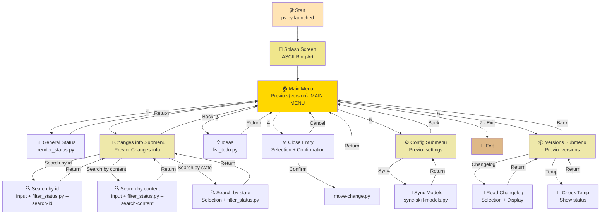
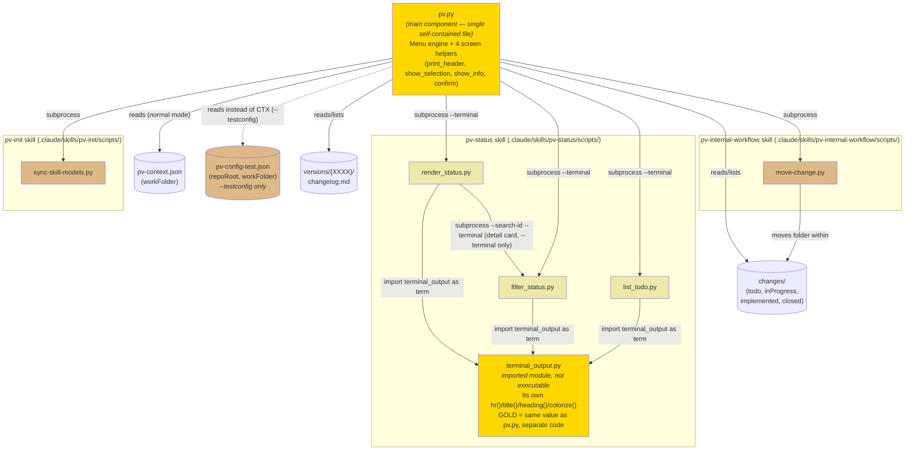

# pv.py Design Document

## Table of contents

- [Purpose](#purpose)
- [Screen Hierarchy](#screen-hierarchy)
- [Navigation Flow](#navigation-flow)
- [Component Diagram](#component-diagram)
- [File Organization](#file-organization)
- [The Four Screen Helpers](#the-four-screen-helpers)
- [Style by Screen Type](#style-by-screen-type)
  - [The Detail Card](#the-detail-card)
- [Command-Line Configuration](#command-line-configuration)
- [How to Extend pv.py](#how-to-extend-pvpy)
  - [Guide for Extending pv.py](#guide-for-extending-pvpy)
  - [Common Mistakes When Extending](#common-mistakes-when-extending)
- [External Dependencies](#external-dependencies)
- [Accessibility Features](#accessibility-features)
- [Reference Configuration File](#reference-configuration-file)

## Purpose

`pv.py` is an interactive command-line script that serves as a unified entry point for the `pv-*` framework. It lets advanced users:
- Inspect the general project status and changes in progress
- Filter changes by state (todo, inProgress, implemented, etc.)
- Review pending ideas
- Close implemented entries (move from `changes/implemented/` to `changes/closed/`)
- Sync skill configuration
- Review versions and their changelogs

**Note:** This script is generated automatically from `.claude/skills/pv-init/assets/pv.py` on every install/update. It must not be edited by hand at the repo root. It's a **single self-contained file** by design (not a folder of modules) — that way `pv-init` copies it as-is to `{repo root}/pv.py` without depending on a package structure.

---

## Screen Hierarchy

```
LEVEL 0 (Splash)
└── RING_ART (ASCII + gradient colors)

LEVEL 1 (Main Navigation)
└── "Previo v{version}: MAIN MENU" ({version} = pv-init/SKILL.md's metadata.version)
    ├── [1] Action: Show Status (→ external)
    ├── [2] Submenu: Changes info
    │   └── "Previo: Changes info"
    │       ├── [1] Action: Search by id
    │       │   └── Input: search id (→ external, every state, no description.md reads except the match's)
    │       ├── [2] Action: Search by content
    │       │   └── Input: search text (→ external, every state, reads every entry's description.md)
    │       ├── [3] Action: Search by state
    │       │   └── Selection: "Available states:" (→ external, one state)
    │       └── [4] Back
    ├── [3] Action: Show Ideas (→ external)
    ├── [4] Action: Close Entry
    │   └── Selection: "Implemented entries..."
    │       └── Confirmation: "Confirm moving..."
    ├── [5] Submenu: Configuration
    │   └── "Previo: settings"
    │       ├── [1] Action: Sync Models (→ external)
    │       └── [2] Back
    ├── [6] Submenu: Versions
    │   └── "Previo: versions"
    │       ├── [1] Action: Changelog
    │       │   └── Selection: "Available versions:"
    │       │       └── Info: Show changelog.md
    │       ├── [2] Action: Check Temp
    │       │   └── Info: State of the temp directory
    │       └── [3] Back
    └── [7] Exit
```

---

## Navigation Flow



---

## Component Diagram

`pv.py` is a single, self-contained file (it doesn't import anything from any other Python module) — but **three of its menu options** delegate their entire rendering to an external script, run as a subprocess via `run_script()`. Those scripts, in turn, import a shared module from the `pv-status` skill that draws its own header with a color/style independent from `pv.py`'s. This diagram lays out that boundary clearly, since it's the most likely source of confusion when debugging a visual issue: **"is the bug in `pv.py` or in another component?"**



**Key takeaway from the diagram:**
- `pv.py` **never imports** anything — all communication with the other components goes through `subprocess.run()` (the `run_script()` function), meaning independent child processes that print to stdout. `pv.py` can't intercept or reformat that output.
- `terminal_output.py` (highlighted in gold, same as `pv.py`) is the **only other component that draws colored screens** — and it does so with its own code, without reusing any function from `pv.py`. If a "PROJECT STATUS" or "IDEAS IN TODO/" screen looks wrong, the fix belongs in `terminal_output.py`, never in `pv.py` (see the comment in `pv.py`'s own code, right before `show_general_status()`).
- `move-change.py` and `sync-skill-models.py` are simple, single-step mutations with no rendering of their own — their output is plain text, no ANSI.
- None of these components import each other, except `terminal_output.py` by `pv-status`'s three scripts — they're all independent processes connected only by argument convention (`--terminal`, `--xxxx`, etc.) and by the framework's paths (`changes/`, `versions/`).
- `render_status.py` **does invoke** `filter_status.py` as a subprocess (`--search-id --terminal`, for the "detail card" at the end of page 3) — it's the only edge of this kind between two sibling `pv-status` scripts (every other one runs from `pv.py` toward a script, never between scripts). It's still not an `import`: each remains an independent process printing to stdout, `render_status.py` can't intercept or reformat what `filter_status.py` prints.
- `pv-config-test.json` (dashed line, only active with the `--testconfig` flag — see "Command-Line Configuration") fully replaces `pv-context.json` as the source of `workFolder`, and also supplies `repoRoot` so `pv.py` can still locate the real `.claude/skills/...` scripts even when run as `test/pv-test.py`, outside the repo root. `pv.py` never reads both files in the same run — it's one or the other, never a mix.

---

## File Organization

The file is split into blocks delimited by `# ====...====` comments, in this fixed order. When adding code, place it in the block it belongs to — don't slot it into another one just because it's near where it's used:

| Block | Contains | Touch it when... |
|---|---|---|
| `Rendering primitives` | `WIDTH`, colors (`GOLD`/`DARK_GRAY`), `colorize()`, `hr()`, `wrap()`, `RING_ART` | Almost never — changes the global color/width system |
| `Screen-type helpers` | `print_header()`, `show_selection()`, `show_info()`, `confirm()` | Almost never — changes the behavior of a screen type across **all** options at once |
| `Framework paths and shared lookups` | `work_root()`, `changes_dir()`, `versions_dir()`, `framework_version()`, `run_script()`, `load_test_config()` | When adding a new framework path or subfolder several options need |
| `Actions -- root menu` | Action functions for the root menu | When adding a new option to "Previo: MAIN MENU" |
| `Actions -- Configuration submenu` | Action functions for "Previo: settings" | When adding a new option to Configuration |
| `Actions -- Versions submenu` | Action functions for "Previo: versions" | When adding a new option to Versions |
| `Actions -- Changes info submenu` | Action functions for "Previo: Changes info" (`search_by_id()`, `search_by_content()`, `search_by_state()`, `list_states()`) | When adding a new option to Changes info |
| `Root menu definition` | The `MENU` list | When registering any new root menu option (always the last step) |
| `Menu engine` | `run_menu()`, `main()` | Almost never — changes the navigation loop for **all** menus at once |

For a new submenu (other than Configuration or Versions), add a `# Actions -- My New Submenu` block following the same pattern, placed before `Root menu definition`.

---

## The Four Screen Helpers

Every interactive `pv.py` screen is built with one of these four functions. There's no valid fifth "manual" way — if a new option doesn't fit any of them, it probably needs to be broken down into several calls to these helpers.

### `print_header(title)`
Menu header: `hr("=", GOLD)` + title centered in GOLD + `hr("=", GOLD)`. Used internally by `run_menu()` — never called directly from an action function.

### `show_selection(title, options, prompt, extra_option=None) -> int | str | None`
A numbered list framed by `hr("-")` in DARK_GRAY. Takes a list of already-formatted display strings and returns:
- the **0-based index** in `options` of the chosen item, or
- `extra_option`'s lowercase key (e.g. `"a"`) if the non-numeric option was used, or
- `None` if the user canceled (empty input) or typed something invalid.

**Important:** it returns the index, not the option's text — so there's never any ambiguity if two options show the same text. The caller must always check `is None`, never `not result` (an index of `0` is a valid, falsy-in-Python result).

`extra_option` is a `(key, label)` tuple for a non-numeric option mixed into the list, like `("a", "Close all")` in `close_entry()`.

### `show_info(lines, framed=True) -> None`
Displays already-formatted lines of text. `framed=True` frames them with `hr("-")` in DARK_GRAY above and below (use it for "single-piece" content like a full changelog); `framed=False` prints them loose (use it for a short one- or two-sentence message, like a "nothing to show" notice).

### `confirm(question) -> bool`
Asks a `y/N` question with no header of its own — it's always nested inside another screen (usually right after a `show_selection()`). Returns `True` only if the answer is `"y"` or `"yes"` (case-insensitive); anything else, including empty, is `False`.

### `read_input(prompt) -> str`

A wrapper around `input()` — not one of the four screen types, but the single point every `input()` call that expects a real answer (not the "Press Enter to return..." pause) must go through. If the user types `"exit"` (case-insensitive, surrounding whitespace ignored), it quits the whole program instantly (`sys.exit(0)`), with no confirmation and no message — same effect as picking the root menu's numbered "Exit" option, but available from **any** screen that asks for text: `run_menu()`'s prompt, `show_selection()`, `confirm()`, or an action's free-text `input()` like `search_by_id()`/`search_by_content()`.

The three helpers (`show_selection`, `confirm`) and `run_menu()` already use `read_input()` internally — any action function that needs to ask for free text directly (outside those three) must use `read_input()` too, never bare `input()`, or "exit" stops working on that screen. The one deliberate exception is the `input("\nPress Enter to return to the menu...")` pause in `run_menu()`: that pause isn't asking a real question, so any text (including "exit") just continues.

### What NOT to do

- Don't call `hr()` directly from an action function — only the four helpers and `run_menu()` do.
- Don't mix `hr("=", GOLD)` and `hr("-")` (DARK_GRAY) within the same logical screen — each screen uses a single color from start to finish (see "Style by Screen Type").
- Don't compare `show_selection()`'s result with `if not result` — use `if result is None`.
- Don't call `input()` directly in an action function to ask for free text — use `read_input()`, or "exit" won't work on that particular screen (exception: the "Press Enter to return..." pause, which uses `input()` on purpose).

---

## Style by Screen Type

General rule: **one color per full screen**, never mixed within the same logical block. Two levels:

- **GOLD** = "you're navigating" → menu headers (`print_header()`, used by `run_menu()`) and the status screens delegated to `terminal_output.py` (see below)
- **DARK_GRAY** = "you're viewing or picking data" → `show_selection()` and `show_info()` with `framed=True`

### Menu (Main Menu and Submenus) — via `run_menu()` / `print_header()`

Everything in GOLD: the header (top, title, bottom) and also the `hr("=", GOLD)` that closes the option list before the "Choose an option:" prompt. `hr()`'s default is DARK_GRAY, so any new call to `hr()` inside `run_menu()` needs an explicit `color=GOLD` (see "Common Mistakes When Extending", point 1).

```
══════════════════════════════════════════════════════════════════   ← GOLD
                       Previo v0.9.5b7: MAIN MENU                      ← GOLD, centered
══════════════════════════════════════════════════════════════════   ← GOLD
  1. General project status
  2. Changes info
  ...
  7. Exit
══════════════════════════════════════════════════════════════════   ← GOLD
Choose an option:
```

A submenu follows exactly the same pattern — only the title and option text change.

### Selection — via `show_selection()`

Everything in DARK_GRAY: the two `hr("-")` lines and the uncolored title.

```
──────────────────────────────────────────────────────────────────   ← DARK_GRAY
Available states:                                                     ← no color
  1. todo
  2. inProgress
  3. implemented
──────────────────────────────────────────────────────────────────   ← DARK_GRAY
Choose a state (number, or empty to cancel):
```

**Exception: "Available states" (`search_by_state()`).** It's the only `show_selection()` whose individual options carry their own color, one per state — the frame (`hr("-")`, title) stays plain DARK_GRAY, unchanged; only each list row's text is tinted according to which state it belongs to:

| State | Color |
|---|---|
| `todo` | Blue (`STATE_BLUE`, `\033[38;5;75m`) |
| `inProgress` | Yellow (`STATE_YELLOW`, `\033[38;5;220m`) |
| `implemented` | Green (`STATE_GREEN`, `\033[38;5;114m`) |
| `closed` | White (`STATE_WHITE`, `\033[38;5;255m`) |

`search_by_state()` builds the colored label list (`colorize(state, STATE_COLORS[state])`) **before** passing it to `show_selection()`, and keeps the uncolored `states` list separately to index the result — `show_selection()` itself knows nothing about per-state colors, it only ever receives already-formatted display strings (that's the design: "Takes a list of already-formatted display strings", see above). If a new state is ever added to the framework, add its entry to `STATE_COLORS` too, or it falls back to plain DARK_GRAY (indistinguishable from the frame).

### Confirmation — via `confirm()`

No header or color of its own, continues the block of the screen that invoked it:

```
Confirm moving '1001 — Add user authentication' to changes/closed/?
(y/N):
```

### Info — via `show_info()`

`framed=True` uses DARK_GRAY, same as Selection; `framed=False` has no rule at all.

```
──────────────────────────────────────────────────────────────────   ← DARK_GRAY (framed=True)
# Changelog v1.2.0
- Added: new feature X
──────────────────────────────────────────────────────────────────   ← DARK_GRAY
```

```
changes/closed/temp/ isn't empty — the versioning process (pv-version)   ← framed=False,
has either failed or is currently in progress:                            no rule
  - 1003
```

### Delegated info — `render_status.py` / `filter_status.py` / `list_todo.py`

These three options don't use `pv.py`'s helpers — they invoke an external script with `run_script(..., "--terminal")`, and that script controls its own rendering using the sibling module `.claude/skills/pv-status/scripts/terminal_output.py`. That module has its **own** palette (same GOLD value, `\033[38;5;220m`) and its own `hr()`/`title()`/`heading()`, independent from `pv.py` — they share no code, only the color value. The entire block it generates (title, internal table separators, section underlines, closing line) comes out in uniform GOLD, following the same "one color per full screen" rule.

**`render_status.py` — "Versions: N" before the bars.** Page 1 (`render_terminal_page_summary()`) shows the total number of versions (subfolders of `versions/`) right under the title, before the per-state bars — it's the first thing the user sees after the header. `count_versions(changes_dir)` derives `versions_dir` as `changes_dir.parent / "versions"` (a sibling of `changes/` under the same `workFolder`) instead of duplicating the `workFolder` resolution `collect_status.py` already does — `collect_status.py` only ever knows `changes_dir`, never `versions_dir`. The same value (`versionsTotal`) was also added to the markdown mode (`render()`/`STATUS.template.md`, field `**Versions:** {versionsTotal}` right before `## Summary`), so `/pv-status` from chat shows it too — both modes share `count_versions()`, no duplicated calculation.

```
======================================================================
                            PROJECT STATUS                             ← GOLD (terminal_output.title)
                        Generated: 2026-08-19
======================================================================

Versions: 3                                                            ← no color, first line after the header

💡 Todo         ████████████████████  2
🔧 In progress  ████████████████████  2
...
```

**"Detail card" after page 3 — `show_change_detail_loop()`.** In `--terminal` mode only, after printing page 3 (`render_terminal_page_rest()`), `render_status.py` asks for an id in a loop (`Enter an id for its detail card, or press Enter to go back:`). Each id entered invokes `filter_status.py --search-id <id> --terminal` as a subprocess (`subprocess.run()`, the same mechanism as `pv.py`'s `run_script()`, but from inside a `pv-status` script, not `pv.py`) — meaning it shows exactly **the same "detail card"** already used by "Search by id" in `pv.py`'s "Changes info" submenu, including its "no match" message if the id doesn't match any state. After showing the card (found or not), it asks again — the loop only ends on empty input, which makes the script exit and hand control back to whoever invoked it (`pv.py`, which then shows its own "Press Enter to return to the menu..." pause), the same as before this prompt existed.

This prompt **doesn't appear in markdown mode** (`render()`, used by `/pv-status` from chat) — it's `--terminal`-exclusive, since `filter_status.py --search-id` is itself `--terminal`-only.

`filter_status.py` has **three entry points** from `pv.py`, all inside the "Changes info" submenu: `search_by_state()` invokes it with `<state> --terminal` (the original `show_filtered_status()`, just renamed); `search_by_id()` invokes it with `--search-id <text> --terminal`; and `search_by_content()` invokes it with `--search-content <text> --terminal`. The two searches were deliberately split into two menu options (and two separate CLI flags) instead of one combined search — that way each stays as fast as the kind of lookup it's actually doing: `--search-id` scans every state comparing only folder names (no `description.md` reads except the one match's), while `--search-content` has to read every entry's `description.md` to filter by content — no way around that. All three modes share `render_terminal()` — the title switches between `PROJECT STATUS — {state}` and `PROJECT STATUS — search: {text}`, and in search mode (by id or by content) each row prefixes the id with its origin state in parentheses (`(implemented)  1001  ...`), since results cross states.

**`--search-id` ignores zero-padding.** Ids under `changes/{inProgress,implemented,closed}` are zero-padded numbers (`00001`), but `todo/`'s are short alphanumeric codes (`a3f9k`) that aren't. `ids_match()` compares both sides as integers when both are digits-only (so `1`, `01`, and `00001` all find the same entry) and falls back to a case-insensitive string comparison otherwise (so `todo/`'s alphanumeric ids keep working, and a numeric id never accidentally matches an alphanumeric one).

```
══════════════════════════════════════════════════════════════════   ← GOLD (terminal_output.hr)
                      PROJECT STATUS — closed                         ← GOLD (terminal_output.title)
                       Generated: 2026-08-18
══════════════════════════════════════════════════════════════════   ← GOLD
```

### The Detail Card

The fixed name (along with "detail card") we use, in this document and in development conversation, for the block `render_terminal()` (in `filter_status.py`) prints per entry — it's the format shared by **all three** routes that reach `render_terminal()`: "Filter by state" (`<state>`), "Search by id" (`--search-id`), "Search by content" (`--search-content`), and also the id prompt at the end of "Project status" (`render_status.py`'s `show_change_detail_loop()`, which delegates to `filter_status.py --search-id`). All four routes produce exactly the same block — there's no fifth variant.

No color of its own (inherits the GOLD of the surrounding block only for the screen's title/closing rule, the body stays uncolored, same as the rest of "Delegated info"). The format is the same regardless of mode — the `(state)` prefix on line 1 is always shown, even in "Filter by state" where the screen's own title already says it (unified on purpose so the card always looks the same, instead of having a slightly different format depending on how you got to it).

There are **two content variants, with a different number of lines** — 4 lines for change/fix, 3 for idea (`todo/`, no `Risk`, no separate description line, see why below):

#### Change/fix card (`inProgress`/`implemented`/`closed`)

```
(implemented)  1001  [🆕 Change]  Risk: 6/10  ← Line 1: (state), id, type, risk — no date here
created: 2026-08-01, planned: 2026-08-03      ← Line 2: created = description.md, planned = plan.md ("pending" if absent)
> Add user authentication                     ← Line 3: name (description.md's **Name** field), "> " prefix
  Lets users sign in with email and           ← Line 4: first 200 characters of the
  password, backed by a new sessions table…      description (## Full description), with "…" if truncated
```

- **`created`** (line 2): `description.md`'s `**Creation date**` field (bold inline); falls back to `description.md`'s mtime if absent.
- **`planned`** (line 2): `plan.md`'s `**Creation date**` field (same bold-inline format, see `PLAN.template.md`) — the date `pv-how` wrote the plan on, not the change's creation date. If `plan.md` doesn't exist yet, or exists but lacks that field, shows literally **`pending`** (not a dash or "unknown" — explicitly signals planning hasn't happened yet). `build_entry()` computes this by reusing `extract_date()` on `plan.md`'s text, no new pattern needed — the field has the exact same format in both files.
- **`Risk`** (line 1): `plan.md`'s `**Risk**` field, `{value}/10` format — `—` if there's no `plan.md` or the field isn't in that exact format.
- Line 4 uses **its own 200-character limit**, separate from and independent of the 250-character limit used by `/pv-status`'s markdown table (chat) — changing one doesn't affect the other; they're two separate rendering paths inside `filter_status.py` (`render_terminal()` vs `render_report()`), and only terminal mode shows the detail card at all (the markdown table has no Name/Planned columns).

#### Idea card (`todo/`)

Different, shorter format than the change/fix card — **3 lines, not 4**: no `Risk` (`todo/` never has `plan.md`, so it would always have been `—` — noise, not information) and no separate description line (the `## Idea` text already serves as the name, there's nothing else to show below it).

```
(todo)  a3f9k  [💡 Todo]                      ← Line 1: (state), id, type — no Risk
created: 2026-08-15                            ← Line 2: created only — no "planned" (todo/ has no plan.md)
> Dark mode                                   ← Line 3: the ## Idea text (see below), "> " prefix
```

`description.md` in `todo/` doesn't follow `pv-new`/`pv-fix`'s `**Name**:`/`**Type**:`/`## Full description` format — it uses `pv-todo`'s own markdown headings (`## Idea`, `## Creation date`, `## Notes`), with no separation between "name" and "description". `build_entry()` detects `state == "todo"` and uses `parse_todo_description()` (reused from `collect_status.py`, the same one `list_todo.py` uses) to extract the `## Idea` text as line 3 (name) — there's no line 4, `render_terminal()` stops there for this variant (`continue` after line 3, before the block that adds the description line). Line 2's `created` also uses its own pattern (`## Creation date`, a heading) instead of `**Creation date**` (bold inline) — `TODO_DATE_RE`, distinct from `DATE_RE`.

**If you touch `terminal_output.py`:** its `hr()` is already GOLD by default (unlike `pv.py`'s `hr()`, which defaults to DARK_GRAY) — any new call to `term.hr(...)` in `render_status.py`/`filter_status.py`/`list_todo.py` comes out gold without needing to pass it a color, so there's no color parameter there (nor does one exist).

### Summary

| Element | Menu (`pv.py`) | Selection | Confirmation | Info: framed=True | Info: framed=False | Info: delegated status |
|---|---|---|---|---|---|---|
| Rule character | `=` | `-` | none | `-` | none | `=` |
| Rule color | GOLD | DARK_GRAY | — | DARK_GRAY | — | GOLD |
| Responsible helper | `print_header()` / `run_menu()` | `show_selection()` | `confirm()` | `show_info(framed=True)` | `show_info(framed=False)` | `terminal_output.title()`/`hr()` |

---

## Command-Line Configuration

```bash
python3 pv.py
```

No arguments, in normal use. Reads configuration from:
- `pv-context.json` for `workFolder`
- Checks that the framework directory exists

### `--testconfig` — for testing `pv.py` only, not normal use

```bash
python3 test/pv-test.py --testconfig
```

Flag exclusive to the framework's own test harness (`test/pv-test.py`, a plain identical copy of `pv.py` with no code of its own, placed under `test/` for convenience). **It takes no argument** — it assumes a file named `pv-config-test.json` sits in the same folder as the script being run (`Path(__file__).resolve().parent`), and exits with an error if it's not there. When passed, `pv.py` **doesn't read** `.claude/pv-context.json` to resolve `workFolder` — instead it reads that `pv-config-test.json`, with two required fields:

```json
{
  "repoRoot": "..",
  "workFolder": "/test/previo-sdd"
}
```

- `repoRoot`: path to the real repo root (where `.claude/skills/...` lives), **resolved relative to the config file's own location** (itself always next to the script), not the directory the script is invoked from. Needed because `pv.py` still invokes the framework's real scripts (`filter_status.py`, `render_status.py`, etc.) — never copies — so it needs to know where they are.
- `workFolder`: the test `workFolder` to use instead of the one configured in `pv-context.json` (e.g. `/test/previo-sdd`), so the project's real data is never touched.

`run_script()` forwards this `workFolder` as `--work-folder <value>` to the 4 scripts that already support that override (`filter_status.py`, `render_status.py`, `list_todo.py`, `move-change.py`) — `sync-skill-models.py` is excluded since it doesn't touch `changes/`/`workFolder` at all and has no such flag.

If `pv-config-test.json` isn't found next to the script, has invalid JSON, or is missing `repoRoot`/`workFolder`, `pv.py` exits with a clear error message (`sys.exit`, no traceback) — it never proceeds with a silent default.

---

## How to Extend pv.py

### Guide for Extending pv.py

This section is the quick reference for adding new options without breaking visual consistency. Follow these steps in order.

#### Adding a read-only option to the root menu

1. Write a `def show_my_option() -> None:` function in the `# Actions -- root menu` section (or create a new `# Actions -- ...` section if it groups several related new options).
2. Inside, use **one of the four helpers** (`show_selection`, `show_info`, `confirm`, or `run_script` if it delegates to an external script) — never call `hr()`/`print()`/`colorize()` loose directly in an action function.
3. Add `("Visible label", show_my_option)` to the `MENU` list near the end of the file.
4. Don't mark `is_submenu` — only the `show_*_menu()` functions that call `run_menu()` carry it.

#### Adding a new submenu

1. Copy the pattern from `show_settings_menu()` or `show_versions_menu()`: a function that calls `run_menu(title, items, "Back")`.
2. Right below it, add `my_submenu.is_submenu = True` — without this line, the parent menu injects a double "Press Enter..." pause (one from the submenu on exit, another from the parent treating it as if it were a leaf action).
3. Write the submenu's actions as regular functions (previous step) in their own `# Actions -- My Submenu` section.
4. Add `("My Submenu", show_my_submenu)` to `MENU` (or to another submenu's `items`, if it's nested deeper).

#### Adding an option that mutates state (like "Close entry")

1. Follow the pattern from `close_entry()`: `show_selection()` to pick the target, **always** followed by `confirm()` before running anything irreversible.
2. Delegate the actual mutation to a script from the corresponding skill via `run_script()` — `pv.py` must not write file content or business logic, only orchestrate. See "Single extension point" below.
3. Never run the mutation without going through `confirm()` first, not even for a "simple" option.

#### Single extension point (complexity boundary)

Any new option must be either:
- **Purely read-only** (delegates to an existing `--terminal` script or a new read-only one), or
- **A simple mutation already validated by its own script** (like moving a folder), always with an explicit `confirm()` first.

More complex mutations (deleting, creating versions, drafting file content) stay **out of `pv.py`'s scope** — they need context only the corresponding skill can provide via Claude Code. Don't add that logic here even if it seems convenient.

### Common Mistakes When Extending

Real friction points in this design — watch out for them when adding new code.

1. **`hr()` doesn't default to GOLD.** Its default is DARK_GRAY; any new `hr()` inside `run_menu()`/`print_header()` (or any code that should belong to the "menu" level) needs an explicit `color=GOLD`, or the line comes out gray and mixes two levels within the same screen.

2. **Comparing `show_selection()`'s result with `if not result`.** Since the helper returns a 0-based index, choosing the first option (`index 0`) is falsy in Python and would be mistaken for a cancellation. Always use `if result is None`.

3. **Using an option's text instead of its index to locate the original data.** If two displayed options share the same text (e.g. two entries with the same `code — name`), searching by text would return the first match instead of the chosen one. `show_selection()` avoids this at the root by returning the index, not the text — always use it that way.

4. **Adding file-mutation logic directly in `pv.py`.** Any change that touches content (not just moving a folder) belongs in a script from the corresponding skill, invoked via `run_script()` — see "Single extension point".

5. **Touching `terminal_output.py` without remembering it's an independent module.** It shares the GOLD color value with `pv.py` but imports nothing from it, nor vice versa — a palette change in one doesn't automatically propagate to the other.

---

## External Dependencies

### Scripts Run

| Script | Location | Purpose |
|--------|-----------|-----------|
| `render_status.py` | `.claude/skills/pv-status/scripts/` | Show general status; in `--terminal`, after page 3 delegates to `filter_status.py --search-id` to show an entered id's detail card |
| `list_todo.py` | `.claude/skills/pv-status/scripts/` | List ideas in todo/ |
| `filter_status.py` | `.claude/skills/pv-status/scripts/` | Filter changes by state (`<state>`), search by exact id across every state (`--search-id <text>`), or search by `description.md` content across every state (`--search-content <text>`) |
| `sync-skill-models.py` | `.claude/skills/pv-init/scripts/` | Sync skill models |
| `move-change.py` | `.claude/skills/pv-internal-workflow/scripts/` | Move entry to closed |
| `terminal_output.py` | `.claude/skills/pv-status/scripts/` | Rendering module shared by `pv-status`'s three scripts (not an executable script, it's imported) |

### Files and Directories

| Path | Purpose |
|------|-----------|
| `pv-context.json` | Framework configuration |
| `pv-init/SKILL.md` | Read (not executed) by `framework_version()` to get the `pv-*` framework's own version (YAML frontmatter's `metadata.version`) shown in the main menu's title — distinct from the project's own version under `versions/{XXXX}/` |
| `changes/` | Changes directory (states) |
| `changes/implemented/` | Completed changes |
| `changes/closed/` | Closed changes |
| `changes/closed/temp/` | Temporary storage during versioning |
| `versions/` | Version history |
| `versions/{XXXX}/changelog.md` | Changelog per version |

---

## Accessibility Features

- **Windows ANSI support:** Enables ENABLE_VIRTUAL_TERMINAL_PROCESSING on Windows 11
- **No color:** Detects the `NO_COLOR` environment variable and disables colors
- **Terminal-responsive:** Detects `sys.stdout.isatty()` for colors
- **Maximum width:** 80 characters for readability in small terminals
- **UTF-8 encoding:** Forces UTF-8 on Python's output

---

## Reference Configuration File

```python
WIDTH = 80                      # Maximum line width
COLOR_RESET = "\033[0m"         # ANSI reset
GOLD = "\033[38;5;220m"         # Gold color (menus, delegated status)
DARK_GRAY = "\033[38;5;238m"    # Dark gray color (selection, framed info)

# Only used to tint each "Available states:" option (search_by_state()) --
# a one-off exception to "one color per screen", see "Selection — via show_selection()".
STATE_BLUE = "\033[38;5;75m"    # todo
STATE_YELLOW = "\033[38;5;220m" # inProgress
STATE_GREEN = "\033[38;5;114m"  # implemented
STATE_WHITE = "\033[38;5;255m"  # closed
```
