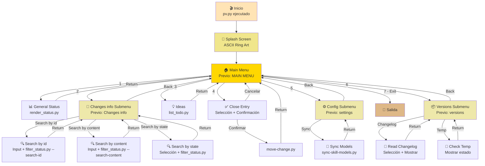
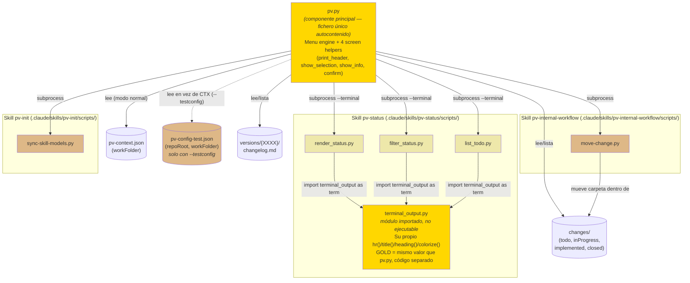

# pv.py Design Document

## Índice

- [Propósito](#propósito)
- [Jerarquía de Pantallas](#jerarquía-de-pantallas)
- [Flujo de Navegación](#flujo-de-navegación)
- [Diagrama de Componentes](#diagrama-de-componentes)
- [Organización del Fichero](#organización-del-fichero)
- [Los Cuatro Helpers de Pantalla](#los-cuatro-helpers-de-pantalla)
- [Estilo por Tipo de Pantalla](#estilo-por-tipo-de-pantalla)
- [Configuración de Línea de Comandos](#configuración-de-línea-de-comandos)
- [Cómo extender pv.py](#cómo-extender-pvpy)
  - [Guía para Extender pv.py](#guía-para-extender-pvpy)
  - [Errores Comunes al Extender](#errores-comunes-al-extender)
- [Dependencias Externas](#dependencias-externas)
- [Características de Accesibilidad](#características-de-accesibilidad)
- [Archivo de Configuración de Referencia](#archivo-de-configuración-de-referencia)

## Propósito

`pv.py` es un script interactivo de línea de comandos que sirve como punto de entrada unificado para el framework `pv-*`. Permite a usuarios avanzados:
- Inspeccionar el estado general del proyecto y cambios en progreso
- Filtrar cambios por estado (todo, inProgress, implemented, etc.)
- Revisar ideas pendientes
- Cerrar entradas implementadas (mover de `changes/implemented/` a `changes/closed/`)
- Sincronizar configuración de skills
- Revisar versiones y sus changelogs

**Nota:** Este script se genera automáticamente desde `.claude/skills/pv-init/assets/pv.py` en cada instalación/actualización. No debe editarse manualmente en la raíz del repo. Es un **fichero único autocontenido** por diseño (no una carpeta de módulos) — así `pv-init` lo copia tal cual a `{raíz del repo}/pv.py` sin depender de una estructura de paquete.

---

## Jerarquía de Pantallas

```
NIVEL 0 (Splash)
└── RING_ART (ASCII + colores gradiente)

NIVEL 1 (Main Navigation)
└── "Previo: MAIN MENU"
    ├── [1] Acción: Show Status (→ externo)
    ├── [2] Submenu: Changes info
    │   └── "Previo: Changes info"
    │       ├── [1] Acción: Search by id
    │       │   └── Input: id de búsqueda (→ externo, todos los estados, sin leer description.md salvo del match)
    │       ├── [2] Acción: Search by content
    │       │   └── Input: texto de búsqueda (→ externo, todos los estados, lee description.md de cada entrada)
    │       ├── [3] Acción: Search by state
    │       │   └── Selection: "Available states:" (→ externo, un estado)
    │       └── [4] Back
    ├── [3] Acción: Show Ideas (→ externo)
    ├── [4] Acción: Close Entry
    │   └── Selection: "Implemented entries..."
    │       └── Confirmation: "Confirm moving..."
    ├── [5] Submenu: Configuration
    │   └── "Previo: settings"
    │       ├── [1] Acción: Sync Models (→ externo)
    │       └── [2] Back
    ├── [6] Submenu: Versions
    │   └── "Previo: versions"
    │       ├── [1] Acción: Changelog
    │       │   └── Selection: "Available versions:"
    │       │       └── Info: Mostrar changelog.md
    │       ├── [2] Acción: Check Temp
    │       │   └── Info: Estado del directorio temp
    │       └── [3] Back
    └── [7] Exit
```

---

## Flujo de Navegación



---

## Diagrama de Componentes

`pv.py` es un fichero único y autocontenido (no importa nada de ningún otro módulo Python) — pero **tres de sus opciones de menú** delegan su render completo en un script externo, ejecutado como subproceso vía `run_script()`. Esos scripts, a su vez, importan un módulo compartido de la skill `pv-status` que dibuja su propia cabecera con un color/estilo independiente del de `pv.py`. Este diagrama muestra esa frontera con claridad, porque es la fuente de confusión más probable al depurar un problema visual: **"¿el bug está en `pv.py` o en otro componente?"**



**Lectura clave del diagrama:**
- `pv.py` **nunca importa** nada — toda comunicación con los otros componentes es vía `subprocess.run()` (función `run_script()`), es decir, procesos hijo independientes que imprimen a stdout. `pv.py` no puede interceptar ni reformatear esa salida.
- `terminal_output.py` (resaltado en dorado, igual que `pv.py`) es el **único otro componente que dibuja pantallas con color** — y lo hace con su propio código, no reutilizando ninguna función de `pv.py`. Si una pantalla de "PROJECT STATUS" o "IDEAS IN TODO/" se ve mal, el fix está en `terminal_output.py`, nunca en `pv.py` (ver el comentario en el propio código de `pv.py`, justo antes de `show_general_status()`).
- `move-change.py` y `sync-skill-models.py` son mutaciones simples de un solo paso, sin render propio — su salida es texto plano sin ANSI.
- Ninguno de estos componentes se importa entre sí salvo `terminal_output.py` por los tres scripts de `pv-status` — son todos procesos independientes conectados solo por convención de argumentos (`--terminal`, `--xxxx`, etc.) y por las rutas del framework (`changes/`, `versions/`).
- `pv-config-test.json` (línea discontinua, solo activa con el flag `--testconfig` — ver "Configuración de Línea de Comandos") sustituye por completo a `pv-context.json` como fuente de `workFolder`, y además aporta `repoRoot` para que `pv.py` siga localizando los scripts reales de `.claude/skills/...` aunque se ejecute como `test/pv-test.py`, fuera de la raíz del repo. `pv.py` nunca lee ambos ficheros en la misma ejecución — es uno u otro, nunca una mezcla.

---

## Organización del Fichero

El fichero está dividido en bloques delimitados por comentarios `# ====...====`, en este orden fijo. Al añadir código, colócalo en el bloque que le corresponde — no lo intercales en otro solo porque quede cerca de donde se usa:

| Bloque | Contiene | Tocar cuando... |
|---|---|---|
| `Rendering primitives` | `WIDTH`, colores (`GOLD`/`DARK_GRAY`), `colorize()`, `hr()`, `wrap()`, `RING_ART` | Casi nunca — cambia el sistema de color/ancho global |
| `Screen-type helpers` | `print_header()`, `show_selection()`, `show_info()`, `confirm()` | Casi nunca — cambia el comportamiento de un tipo de pantalla en **todas** las opciones a la vez |
| `Framework paths and shared lookups` | `work_root()`, `changes_dir()`, `versions_dir()`, `run_script()`, `load_test_config()` | Al añadir una nueva ruta o subcarpeta del framework que varias opciones necesiten |
| `Actions -- root menu` | Funciones de acción del menú raíz | Al añadir una opción nueva a "Previo: MAIN MENU" |
| `Actions -- Configuration submenu` | Funciones de acción de "Previo: settings" | Al añadir una opción nueva a Configuration |
| `Actions -- Versions submenu` | Funciones de acción de "Previo: versions" | Al añadir una opción nueva a Versions |
| `Actions -- Changes info submenu` | Funciones de acción de "Previo: Changes info" (`search_by_id()`, `search_by_content()`, `search_by_state()`, `list_states()`) | Al añadir una opción nueva a Changes info |
| `Root menu definition` | La lista `MENU` | Al registrar cualquier opción nueva del menú raíz (último paso siempre) |
| `Menu engine` | `run_menu()`, `main()` | Casi nunca — cambia el bucle de navegación para **todos** los menús a la vez |

Para un submenú nuevo (no Configuration ni Versions), añade un bloque `# Actions -- Mi Submenú Nuevo` siguiendo el mismo patrón, colocado antes de `Root menu definition`.

---

## Los Cuatro Helpers de Pantalla

Toda pantalla interactiva de `pv.py` se construye con una de estas cuatro funciones. No hay una quinta forma "manual" válida — si una opción nueva no encaja en ninguna, probablemente necesita descomponerse en varias llamadas a estos helpers.

### `print_header(title)`
Cabecera de menú: `hr("=", GOLD)` + título centrado en GOLD + `hr("=", GOLD)`. La usa internamente `run_menu()` — no se llama nunca directamente desde una función de acción.

### `show_selection(title, options, prompt, extra_option=None) -> int | str | None`
Lista numerada enmarcada por `hr("-")` en DARK_GRAY. Recibe una lista de strings ya formateados para mostrar y devuelve:
- el **índice 0-based** en `options` de lo elegido, o
- la clave de `extra_option` en minúsculas (p.ej. `"a"`) si se usó la opción no numérica, o
- `None` si el usuario canceló (input vacío) o escribió algo inválido.

**Importante:** devuelve el índice, no el texto de la opción — así nunca hay ambigüedad si dos opciones muestran el mismo texto. El caller siempre debe comprobar `is None`, nunca `not resultado` (un índice `0` es un resultado válido y falsy en Python).

`extra_option` es una tupla `(key, label)` para una opción no numérica mezclada en la lista, como `("a", "Close all")` en `close_entry()`.

### `show_info(lines, framed=True) -> None`
Muestra líneas de texto ya formateadas. `framed=True` las enmarca con `hr("-")` en DARK_GRAY arriba y abajo (úsalo para contenido "de una pieza" como un changelog completo); `framed=False` las imprime sueltas (úsalo para un mensaje corto de una o dos frases, como un aviso de "no hay nada que mostrar").

### `confirm(question) -> bool`
Pregunta `y/N` sin cabecera propia — se anida siempre dentro de otra pantalla (normalmente tras un `show_selection()`). Devuelve `True` solo si la respuesta es `"y"` o `"yes"` (case-insensitive); cualquier otra cosa, incluido vacío, es `False`.

### `read_input(prompt) -> str`

Envoltorio de `input()` — no es uno de los cuatro tipos de pantalla, pero es el único punto por el que debe pasar cualquier `input()` que espere una respuesta real (no la pausa "Press Enter to return..."). Si el usuario escribe `"exit"` (case-insensitive, ignorando espacios), termina el programa entero al instante (`sys.exit(0)`), sin confirmar ni imprimir nada — funciona igual que elegir la opción numerada "Exit" del menú raíz, pero disponible desde **cualquier** pantalla que pida texto: el prompt de `run_menu()`, `show_selection()`, `confirm()`, o el `input()` libre de una acción como `search_by_id()`/`search_by_content()`.

Los tres helpers (`show_selection`, `confirm`) y `run_menu()` ya usan `read_input()` internamente — cualquier función de acción que necesite pedir texto libre directamente (fuera de esos tres) debe usar `read_input()` también, nunca `input()` a secas, para que "exit" siga funcionando ahí. La única excepción deliberada es la pausa `input("\nPress Enter to return to the menu...")` en `run_menu()`: esa pausa no pide una respuesta real, cualquier texto (incluido "exit") simplemente continúa.

### Lo que NO hay que hacer

- No llamar a `hr()` directamente desde una función de acción — solo los cuatro helpers y `run_menu()` lo hacen.
- No mezclar `hr("=", GOLD)` y `hr("-")` (DARK_GRAY) dentro de la misma pantalla lógica — cada pantalla usa un único color de principio a fin (ver "Estilo por Tipo de Pantalla").
- No comparar el resultado de `show_selection()` con `if not resultado` — usa `if resultado is None`.
- No llamar a `input()` directamente en una función de acción para pedir texto libre — usa `read_input()`, o "exit" dejará de funcionar en esa pantalla concreta (excepción: la pausa "Press Enter to return...", que sí usa `input()` a propósito).

---

## Estilo por Tipo de Pantalla

Regla general: **un color por pantalla completa**, nunca mezclado dentro del mismo bloque lógico. Dos niveles:

- **GOLD** = "estás navegando" → cabeceras de menú (`print_header()`, usado por `run_menu()`) y las pantallas de status delegadas en `terminal_output.py` (ver más abajo)
- **DARK_GRAY** = "estás viendo o eligiendo datos" → `show_selection()` y `show_info()` con `framed=True`

### Menú (Main Menu y Submenús) — vía `run_menu()` / `print_header()`

Todo en GOLD: la cabecera (arriba, título, abajo) y también el `hr("=", GOLD)` que cierra la lista de opciones antes del prompt "Choose an option:". El default de `hr()` es DARK_GRAY, así que cualquier llamada nueva a `hr()` dentro de `run_menu()` necesita `color=GOLD` explícito (ver "Errores Comunes al Extender", punto 1).

```
══════════════════════════════════════════════════════════════════   ← GOLD
                          Previo: MAIN MENU                            ← GOLD, centrado
══════════════════════════════════════════════════════════════════   ← GOLD
  1. General project status
  2. Changes info
  ...
  7. Exit
══════════════════════════════════════════════════════════════════   ← GOLD
Choose an option:
```

Un submenú usa exactamente el mismo patrón — cambia solo el texto de título y opciones.

### Selección — vía `show_selection()`

Todo en DARK_GRAY: las dos líneas `hr("-")` y el título sin colorear.

```
──────────────────────────────────────────────────────────────────   ← DARK_GRAY
Available states:                                                     ← sin color
  1. todo
  2. inProgress
  3. implemented
──────────────────────────────────────────────────────────────────   ← DARK_GRAY
Choose a state (number, or empty to cancel):
```

**Excepción: "Available states" (`search_by_state()`).** Es el único `show_selection()` cuyas opciones individuales llevan color propio, uno por estado — el marco (`hr("-")`, título) sigue siendo DARK_GRAY sin cambios, solo el texto de cada línea de la lista se tiñe según a qué estado pertenece:

| Estado | Color |
|---|---|
| `todo` | Azul (`STATE_BLUE`, `\033[38;5;75m`) |
| `inProgress` | Amarillo (`STATE_YELLOW`, `\033[38;5;220m`) |
| `implemented` | Verde (`STATE_GREEN`, `\033[38;5;114m`) |
| `closed` | Blanco (`STATE_WHITE`, `\033[38;5;255m`) |

`search_by_state()` construye la lista de etiquetas coloreadas (`colorize(state, STATE_COLORS[state])`) **antes** de pasarla a `show_selection()`, y mantiene por separado la lista `states` sin colorear para indexar el resultado — `show_selection()` en sí no sabe nada de colores por estado, solo recibe strings ya formateados (así es como está diseñado: "Recibe una lista de strings ya formateados para mostrar", ver más abajo). Si se añade un nuevo estado al framework, hay que añadir su entrada a `STATE_COLORS` o cae en el fallback DARK_GRAY (sin distinguir).

### Confirmación — vía `confirm()`

Sin cabecera ni color propio, continúa el bloque de la pantalla que la invocó:

```
Confirm moving '1001 — Add user authentication' to changes/closed/?
(y/N):
```

### Info — vía `show_info()`

`framed=True` usa DARK_GRAY igual que Selección; `framed=False` no lleva regla ninguna.

```
──────────────────────────────────────────────────────────────────   ← DARK_GRAY (framed=True)
# Changelog v1.2.0
- Added: nueva funcionalidad X
──────────────────────────────────────────────────────────────────   ← DARK_GRAY
```

```
changes/closed/temp/ isn't empty — the versioning process (pv-version)   ← framed=False,
has either failed or is currently in progress:                            sin regla
  - 1003
```

### Info delegada — `render_status.py` / `filter_status.py` / `list_todo.py`

Estas tres opciones no usan los helpers de `pv.py` — invocan un script externo con `run_script(..., "--terminal")`, y ese script controla su propio render usando el módulo hermano `.claude/skills/pv-status/scripts/terminal_output.py`. Ese módulo tiene su **propia** paleta (mismo valor GOLD, `\033[38;5;220m`) y su propio `hr()`/`title()`/`heading()`, independiente de `pv.py` — no comparten código, solo el valor de color. Todo el bloque que genera (título, separadores internos de tabla, subrayados de sección, línea de cierre) sale en GOLD uniforme, siguiendo la misma regla de "un color por pantalla completa".

`filter_status.py` tiene **tres puntos de entrada** desde `pv.py`, todos dentro del submenú "Changes info": `search_by_state()` lo invoca con `<estado> --terminal` (el `show_filtered_status()` original, solo renombrado); `search_by_id()` lo invoca con `--search-id <texto> --terminal`; y `search_by_content()` lo invoca con `--search-content <texto> --terminal`. Las dos búsquedas se separaron deliberadamente en dos opciones de menú (y dos flags CLI distintos) en vez de una sola combinada — así cada una es tan rápida como el tipo de búsqueda que hace de verdad: `--search-id` recorre todos los estados comparando solo el nombre de carpeta (sin leer ningún `description.md` salvo el de la entrada que ya matcheó), mientras `--search-content` sí necesita leer el `description.md` de cada entrada para poder filtrar por contenido — no hay forma de evitarlo. Los tres modos comparten `render_terminal()` — el título cambia entre `PROJECT STATUS — {estado}` y `PROJECT STATUS — search: {texto}`, y en modo búsqueda (por id o por contenido) cada fila añade el estado de origen entre paréntesis antes del id (`(implemented)  1001  ...`), ya que los resultados cruzan estados.

**`--search-id` ignora el padding de ceros.** Los ids de `changes/{inProgress,implemented,closed}` son números con ceros a la izquierda (`00001`), pero los de `todo/` son códigos alfanuméricos cortos (`a3f9k`) que no lo son. `ids_match()` compara ambos lados como enteros cuando los dos son solo dígitos (así `1`, `01` y `00001` encuentran la misma entrada) y cae a comparación de string case-insensitive en cualquier otro caso (para no romper los ids alfanuméricos de `todo/`, ni matchear un id numérico con uno alfanumérico por casualidad).

```
══════════════════════════════════════════════════════════════════   ← GOLD (terminal_output.hr)
                      PROJECT STATUS — closed                         ← GOLD (terminal_output.title)
                       Generated: 2026-08-18
══════════════════════════════════════════════════════════════════   ← GOLD
```

**Formato de fila en `filter_status.py --terminal` ("Filter by state").** Cada entrada listada ocupa tres líneas sin color propio (heredan el GOLD del bloque que las contiene solo en el título/cierre, el cuerpo va sin colorear, igual que el resto de "Info delegada"):

```
1001  [🆕 Change]  Risk: 6/10  2026-08-01     ← Línea 1: id, tipo, fecha, riesgo
> Add user authentication                     ← Línea 2: nombre (description.md, campo **Name**), prefijo "> "
  Lets users sign in with email and           ← Línea 3: primeros 200 caracteres de la
  password, backed by a new sessions table…      descripción (## Full description), con "…" si se trunca
```

Esta línea 3 usa **su propio límite de 200 caracteres**, distinto e independiente de los 250 caracteres que usa la tabla markdown de `/pv-status` (chat) — cambiar uno no afecta al otro; son dos rutas de render separadas dentro de `filter_status.py` (`render_terminal()` vs `render_report()`), y solo el modo terminal muestra el nombre en absoluto (la tabla markdown no tiene columna Name).

**Caso especial: entradas en `todo/`.** `description.md` en `todo/` no sigue el formato `**Name**:`/`**Type**:`/`## Full description` de `pv-new`/`pv-fix` — usa encabezados markdown propios de `pv-todo` (`## Idea`, `## Creation date`, `## Notes`), sin separación entre "nombre" y "descripción". `build_entry()` detecta `state == "todo"` y usa `parse_todo_description()` (reutilizada de `collect_status.py`, la misma que usa `list_todo.py`) para extraer el texto de `## Idea` como línea 2 (nombre); la línea 3 queda vacía (`—`), ya que no hay una descripción separada del título. La fecha también usa su propio patrón (`## Creation date`, heading) en vez de `**Creation date**` (bold inline).

**Si tocas `terminal_output.py`:** su `hr()` ya es GOLD por defecto (a diferencia del `hr()` de `pv.py`, que es DARK_GRAY por defecto) — cualquier llamada nueva a `term.hr(...)` en `render_status.py`/`filter_status.py`/`list_todo.py` sale dorada sin tener que pasarle color, así que no hace falta (ni existe) un parámetro de color ahí.

### Resumen

| Elemento | Menú (`pv.py`) | Selección | Confirmación | Info: framed=True | Info: framed=False | Info: status delegado |
|---|---|---|---|---|---|---|
| Carácter de regla | `=` | `-` | ninguno | `-` | ninguno | `=` |
| Color de la regla | GOLD | DARK_GRAY | — | DARK_GRAY | — | GOLD |
| Helper responsable | `print_header()` / `run_menu()` | `show_selection()` | `confirm()` | `show_info(framed=True)` | `show_info(framed=False)` | `terminal_output.title()`/`hr()` |

---

## Configuración de Línea de Comandos

```bash
python3 pv.py
```

Sin argumentos, en el uso normal. Lee configuración de:
- `pv-context.json` para `workFolder`
- Verifica existencia de directorio framework

### `--testconfig` — solo para probar `pv.py`, no para uso normal

```bash
python3 test/pv-test.py --testconfig
```

Flag exclusivo del test harness del propio framework (`test/pv-test.py`, una copia idéntica de `pv.py` sin lógica propia, colocada en `test/` por comodidad). **No recibe ningún argumento** — asume que hay un fichero llamado `pv-config-test.json` en la misma carpeta que el script que se está ejecutando (`Path(__file__).resolve().parent`), y sale con error si no existe ahí. Cuando se pasa, `pv.py` **no lee** `.claude/pv-context.json` para resolver `workFolder` — en su lugar lee ese `pv-config-test.json`, con dos campos obligatorios:

```json
{
  "repoRoot": "..",
  "workFolder": "/test/previo-sdd"
}
```

- `repoRoot`: ruta a la raíz real del repo (donde vive `.claude/skills/...`), **resuelta relativa a la ubicación del propio fichero de config** (que a su vez está siempre junto al script), no al directorio desde el que se invoca. Necesaria porque `pv.py` sigue invocando los scripts reales del framework (`filter_status.py`, `render_status.py`, etc.) — nunca copias — así que necesita saber dónde están.
- `workFolder`: el `workFolder` de prueba a usar en vez del configurado en `pv-context.json` (p.ej. `/test/previo-sdd`), para no tocar los datos reales del proyecto.

`run_script()` reenvía este `workFolder` como `--work-folder <valor>` a los 4 scripts que ya soportan ese override (`filter_status.py`, `render_status.py`, `list_todo.py`, `move-change.py`) — `sync-skill-models.py` queda excluido porque no toca `changes/`/`workFolder` en absoluto y no tiene ese flag.

Si `pv-config-test.json` no existe junto al script, tiene JSON inválido, o le falta `repoRoot`/`workFolder`, `pv.py` termina con un mensaje de error claro (`sys.exit`, sin traceback) — nunca sigue adelante con un valor por defecto silencioso.

---

## Cómo extender pv.py

### Guía para Extender pv.py

Esta sección es la referencia rápida para añadir opciones nuevas sin romper la consistencia visual. Sigue estos pasos en orden.

#### Añadir una opción de solo lectura al menú raíz

1. Escribe una función `def show_mi_opcion() -> None:` en la sección `# Actions -- root menu` (o crea una nueva sección `# Actions -- ...` si agrupa varias opciones nuevas relacionadas).
2. Dentro, usa **uno de los cuatro helpers** (`show_selection`, `show_info`, `confirm`, o `run_script` si delega en un script externo) — nunca llames a `hr()`/`print()`/`colorize()` sueltos directamente en una función de acción.
3. Añade `("Etiqueta visible", show_mi_opcion)` a la lista `MENU` cerca del final del fichero.
4. No marques `is_submenu` — solo los `show_*_menu()` que llaman a `run_menu()` lo llevan.

#### Añadir un submenú nuevo

1. Copia el patrón de `show_settings_menu()` o `show_versions_menu()`: una función que llama a `run_menu(title, items, "Back")`.
2. Justo debajo, añade `mi_submenu.is_submenu = True` — sin esta línea, el menú padre inyectará una pausa doble "Press Enter..." (una del submenú al salir, otra del padre al recibirlo como si fuera una acción hoja).
3. Escribe las acciones del submenú como funciones normales (paso anterior) en su propia sección `# Actions -- Mi Submenú`.
4. Añade `("Mi Submenú", show_mi_submenu)` a `MENU` (o al `items` de otro submenú, si es anidado más profundo).

#### Añadir una opción que muta estado (como "Close entry")

1. Sigue el patrón de `close_entry()`: `show_selection()` para elegir el objetivo, **siempre** seguido de `confirm()` antes de ejecutar nada irreversible.
2. Delega la mutación real en un script de la skill correspondiente vía `run_script()` — `pv.py` no debe escribir contenido de ficheros ni lógica de negocio, solo orquestar. Ver "Punto de extensión único" más abajo.
3. Nunca ejecutes la mutación sin pasar por `confirm()` primero, ni siquiera para una opción "simple".

#### Punto de extensión único (límite de complejidad)

Cualquier opción nueva debe ser:
- **Puramente de lectura** (delega en un script `--terminal` existente o uno nuevo de solo lectura), o
- **Una mutación simple ya validada por su propio script** (como mover una carpeta), siempre con `confirm()` explícito antes.

Mutaciones más complejas (borrar, crear versiones, redactar contenido de ficheros) quedan **fuera del alcance de `pv.py`** — necesitan contexto que solo la skill correspondiente puede aportar vía Claude Code. No añadas esa lógica aquí aunque parezca conveniente.

### Errores Comunes al Extender

Puntos de fricción reales de este diseño — ten cuidado con ellos al añadir código nuevo.

1. **`hr()` no colorea por defecto en GOLD.** Su valor por defecto es DARK_GRAY; cualquier `hr()` nuevo dentro de `run_menu()`/`print_header()` (o de cualquier código que deba pertenecer al nivel "menú") necesita `color=GOLD` explícito, o la línea sale gris y mezcla dos niveles dentro de la misma pantalla.

2. **Comparar el resultado de `show_selection()` con `if not resultado`.** Como el helper devuelve un índice 0-based, elegir la primera opción (`índice 0`) es falsy en Python y se confundiría con una cancelación. Usa siempre `if resultado is None`.

3. **Usar el texto de una opción en vez de su índice para localizar el dato original.** Si dos opciones mostradas coinciden en texto (p.ej. dos entradas con el mismo `código — nombre`), buscar por texto devolvería la primera coincidencia en vez de la elegida. `show_selection()` evita esto de raíz devolviendo el índice, no el texto — úsalo siempre así.

4. **Añadir lógica de mutación de fichero directamente en `pv.py`.** Cualquier cambio que toque contenido (no solo mover una carpeta) pertenece a un script de la skill correspondiente, invocado vía `run_script()` — ver "Punto de extensión único".

5. **Tocar `terminal_output.py` sin recordar que es un módulo independiente.** Comparte el valor de color GOLD con `pv.py` pero no importa nada de él ni viceversa — un cambio de paleta en uno no se propaga automáticamente al otro.

---

## Dependencias Externas

### Scripts Ejecutados

| Script | Ubicación | Propósito |
|--------|-----------|-----------|
| `render_status.py` | `.claude/skills/pv-status/scripts/` | Mostrar estado general |
| `list_todo.py` | `.claude/skills/pv-status/scripts/` | Listar ideas en todo/ |
| `filter_status.py` | `.claude/skills/pv-status/scripts/` | Filtrar cambios por estado (`<estado>`), buscar por id exacto en todos los estados (`--search-id <texto>`), o buscar por contenido de `description.md` en todos los estados (`--search-content <texto>`) |
| `sync-skill-models.py` | `.claude/skills/pv-init/scripts/` | Sincronizar modelos de skills |
| `move-change.py` | `.claude/skills/pv-internal-workflow/scripts/` | Mover entrada a closed |
| `terminal_output.py` | `.claude/skills/pv-status/scripts/` | Módulo de rendering compartido por los tres scripts de `pv-status` (no un script ejecutable, se importa) |

### Archivos y Directorios

| Ruta | Propósito |
|------|-----------|
| `pv-context.json` | Configuración del framework |
| `changes/` | Directorio de cambios (estados) |
| `changes/implemented/` | Cambios completados |
| `changes/closed/` | Cambios cerrados |
| `changes/closed/temp/` | Almacenamiento temporal durante versioning |
| `versions/` | Historial de versiones |
| `versions/{XXXX}/changelog.md` | Notas de cambio por versión |

---

## Características de Accesibilidad

- **Soporte Windows ANSI:** Activa ENABLE_VIRTUAL_TERMINAL_PROCESSING en Windows 11
- **Sin color:** Detecta variable de entorno `NO_COLOR` y desactiva colores
- **Responsivo a terminal:** Detecta `sys.stdout.isatty()` para colores
- **Ancho máximo:** 70 caracteres para legibilidad en terminales pequeñas
- **Encodificación UTF-8:** Fuerza UTF-8 en salida de Python

---

## Archivo de Configuración de Referencia

```python
WIDTH = 70                      # Ancho máximo de líneas
COLOR_RESET = "\033[0m"         # ANSI reset
GOLD = "\033[38;5;220m"         # Color dorado (menús, status delegado)
DARK_GRAY = "\033[38;5;238m"    # Color gris oscuro (selección, info framed)

# Solo para colorear cada opción de "Available states:" (search_by_state()) --
# excepción puntual a "un color por pantalla", ver "Selección — vía show_selection()".
STATE_BLUE = "\033[38;5;75m"    # todo
STATE_YELLOW = "\033[38;5;220m" # inProgress
STATE_GREEN = "\033[38;5;114m"  # implemented
STATE_WHITE = "\033[38;5;255m"  # closed
```
