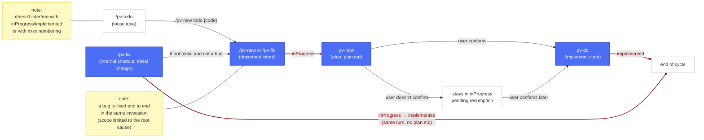
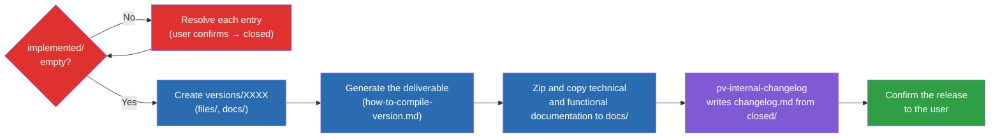

# Previo: Usage guide

**Previo** (framework `pv-*`) is a set of Claude Code skills that standardizes how changes are documented, planned, and implemented in this project. Every real code change goes through the same cycle: **document the intent → plan the technical solution → implement**. Packaging a release (generating the deliverable, copying the current technical documentation, and writing the functional changelog) is also part of the framework: `/pv-version` does it (see [Preparing a release: `/pv-version`](#preparing-a-release-pv-version)).

All skills live under `.claude/skills/pv-*` and share a single configuration file: `.claude/pv-context.json`.

## Table of contents

- [Setup](#setup)
  - [1. Required tools](#1-required-tools)
  - [2. Initialize the framework: `/pv-init`](#2-initialize-the-framework-pv-init)
- [Quick usage guide: the natural flow](#quick-usage-guide-the-natural-flow)
  - [Step 0 (optional) — Jot down loose ideas: `/pv-todo`](#step-0-optional--jot-down-loose-ideas-pv-todo)
  - [Step 1 — Define the change: two ways](#step-1--define-the-change-two-ways)
    - [1. `/pv-new` — new functionality or intentional behavior change](#1-pv-new--new-functionality-or-intentional-behavior-change)
    - [2. `/pv-fix` — fix a bug (or apply a trivial change on the spot)](#2-pv-fix--fix-a-bug-or-apply-a-trivial-change-on-the-spot)
  - [Step 2 — Plan and implement: `pv-how` + `pv-do`](#step-2--plan-and-implement-pv-how--pv-do)
- [Preparing a release: `/pv-version`](#preparing-a-release-pv-version)
- [Full cycle example](#full-cycle-example)
- [More ways to customize Previo](#more-ways-to-customize-previo)
- [Other tricks](#other-tricks)


## Setup

### 1. Required tools

`pv-init` itself checks this for you the first time, but for reference:

- **Git** — the repo already is one; the CLI just needs to work (`git --version`).
- **Python 3** — used by the internal scripts of `pv-internal-workflow`, `pv-how`, and `pv-do` (numbering changes, moving folders). Check with `python --version`.
- **Conditional tools depending on the project**, for example:
  - Node/npm if there's a `package.json`.
  - Any other interpreter the project needs.

Generating a deliverable version **is** part of the `pv-*` framework: `/pv-version` packages it (see [Preparing a release: `/pv-version`](#preparing-a-release-pv-version)). In this repo (Errantes), the underlying build command is `python ./src/scripts/build.py`, which auto-increments `CURRENT_VERSION` in `src/data/version.js` and writes `src/_output/versions/index-v{NNNN}.html` — a folder and numbering scheme of the build script's own, unrelated to `/pv-version`'s numbering.

### 2. Initialize the framework: `/pv-init`

Before using any other `pv-*` skill, you need to run `/pv-init` once per project. It generates `.claude/pv-context.json`, the single place where the configuration lives: where changes are stored, whether the project versions deliverables, where the source code is, which documents to keep in sync, etc.

`pv-init` explores the repo looking for clues (`package.json`, architecture docs...) and only asks about what it can't infer. `workFolder` isn't one of those questions: it's always `/previo-sdd`, set silently without confirmation; if you ever want a different folder, you change it yourself in `.claude/pv-context.json`, at your own risk. If invoked again on an already-initialized project, it lets you reconfigure or fill in missing fields without repeating the whole questionnaire.

Example of an already-configured `.claude/pv-context.json`:

```json
{
  "skillModels": {
    "_instructions": "After editing 'default' or 'overrides' in this section, run from the repo root: python .claude/skills/pv-init/scripts/sync-skill-models.py -- it rewrites the 'model'/'effort' field in each 'pv-*' SKILL.md's frontmatter to match what's configured here. The Claude Code harness only reads that frontmatter, not this JSON, so without running the script the changes here have no effect.",
    "default": { "model": "claude-sonnet-5", "effort": "medium" },
    "overrides": {
      "pv-status": { "model": "claude-haiku-4-5-20251001", "effort": "medium" },
      "pv-todo": { "model": "claude-haiku-4-5-20251001", "effort": "medium" },
      "pv-do": { "model": "claude-haiku-4-5-20251001", "effort": "high" }
    }
  },
  "framework": {
    "skills": {
      "mockups": "pv-internal-mockups-html",
      "diagrams": "pv-internal-tech-mermaid"
    },
    "sourcecodeDir": "/src",
    "workFolder": "/previo-sdd",
    "numberWidth": 5,
    "interaction": { "language": "en" },
    "changes": { "language": "es" },
    "versions": { "language": "es" },
    "docs": {
      "functional": {
        "featuresDocPathDir": "docs/features",
        "language": "es"
      },
      "tech": {
        "architectureDocDir": "docs/architecture",
        "styleBibleDocDir": "docs/style",
        "language": "en"
      }
    }
  }
}
```


`.claude/pv-context.json` also supports two optional blocks for fine-tuning the framework: `skillModels` (which model/effort each skill runs with) and `framework`'s `language` fields (which language each thing speaks or writes in). `pv-init` asks about language on first setup; the detail of both blocks is in [More ways to customize Previo](#more-ways-to-customize-previo).

## Quick usage guide: the natural flow



Blue nodes = a mandatory step of the cycle (Step 1 and Step 2) or its direct-equivalent path (`/pv-fix`'s internal `fast` shortcut, which applies the code without going through `plan.md` if the change — bug or not — qualifies as trivial). White nodes = an entry point or optional operation (`/pv-todo`, or staying pending in `inProgress`). Dark-red arrows with a white background and dark-red text indicate a state change (just the name of the destination folder: `inProgress`, `implemented`); the other arrows indicate only a transition without a folder change. Yellow boxes are clarifying notes connected without an arrow to the node they refer to.

Each work entry lives in a numbered folder `xxxx` (e.g. `00007`) that travels between `changesDir` subfolders according to its state: `inProgress/` → `implemented/`.

### Step 0 (optional) — Jot down loose ideas: `/pv-todo`

Before an idea becomes a change or a fix, you might just want to note it down for later without committing to documenting or implementing it yet. `/pv-todo <idea>` saves it in `changes/todo/{code}/description.md` — a separate folder that no other framework skill uses or takes into account, so it doesn't interfere with `inProgress`/`implemented` or with the `xxxx` numbering.

- **Jot down or expand**: `/pv-todo <idea>` creates a new one; `/pv-todo {code} <more detail>` keeps developing an existing one.
- **Check what's jotted down**: `/pv-status todo` lists pending ideas with their code and full text.
- **Turn into a change**: when an idea from the list matures and you want to bring it into the real flow, `/pv-new todo {code}` starts `pv-new` from that idea instead of a new request, and deletes the `todo/` entry automatically when done (without asking for confirmation) — the idea then lives on as a normal entry in `changes/inProgress/`.

### Step 1 — Define the change: two ways

The framework offers two entry points depending on the nature of the change — the choice depends on whether it's a bug or intentional functionality/change. Within `/pv-fix`, there's also an automatic shortcut for trivial changes (see below).

#### 1. `/pv-new` — new functionality or intentional behavior change

For new functionality or an **intentional** behavior change that isn't trivial. Example: `/pv-new add a button to manually shuffle the event deck`.

#### 2. `/pv-fix` — fix a bug or apply fixes

For a bug — something that should already work differently. Example: `/pv-fix reloading the page loses the current game even though it was saved`. It's also the entry point for something small enough that it doesn't deserve `description.md` + `plan.md` + confirmation (a typo, some text, a single value/constant, an isolated style tweak, whether or not it's a bug): `/pv-fix fix the "Sav" button label to "Save"`.

`pv-fix` first assesses whether the request is trivial (unambiguous, at most 2 files, no new behavior, doesn't touch `docs.tech.architectureDocDir` or `docs.tech.styleBibleDocDir`):

- **If it's trivial** (`fast` shortcut, bug or not): applies the change directly in the code and, in the same invocation, documents what was done in `changes/implemented/{xxxx}/description.md` — it briefly passes through `inProgress` (normal `xxxx` numbering via `pv-internal-workflow`) and moves to `implemented` in the same turn, without generating `plan.md` or chaining `pv-how`/`pv-do`.
- **If it's not trivial and it is a bug**: follows the normal flow described below (document + chain `pv-how`/`pv-do`).
- **If it's not trivial and not a bug** (affects architecture/style, information is missing, touches more than 2 files, or is new functionality): doesn't touch any code, tells you why it doesn't fit, and invokes `pv-new` directly with your request to start the normal documentation flow.

For the non-trivial case (`/pv-new` and the `/pv-fix` that turns out to be a real bug), the skill:

1. Analyzes the scope and **anticipates** typical questions (edge cases, coexistence with what already exists, data scope, who can use it, high-level visual look) and proposes reasonable answers for you to confirm or correct, instead of asking blindly.
2. Generates `changes/inProgress/{xxxx}/description.md` with the functional summary (never the technical solution yet).
3. If the change has a new or modified flow with no UI dimension (logic, the order of an operation, decisions, chained edge cases), includes a functional Mermaid diagram per use case or user story directly in `description.md`.
4. If the change has a visual component, creates static mockups `design_*.html` (HTML/CSS/SVG only, no logic; the `pv-internal-mockups-html` skill by default, configurable via `framework.skills.mockups`) as a navigable visual reference — to validate the design before writing a single line of real code.
5. If the change defines or uses something that needs a list of properties or associated data (an object's properties, the contents of a database table, a configuration's fields...), writes that list explicitly in one or more `design_data_*.md` files, generally as table(s). It's a **functional** definition of what data is needed — how to store or handle it is a technical decision `pv-how` makes afterward, based on that table.

Diagrams, mockups, and data tables are all presented to you for confirmation before the change is considered documented — generating them isn't enough, your explicit validation is required.

Key difference: `/pv-fix` (non-trivial case) automatically chains `pv-how` (which in turn chains `pv-do`) when done (a bug is fixed end to end in the same invocation, with scope strictly limited to the root cause). `/pv-new` only documents — you decide when to plan/implement afterward.

If an entry already exists in `inProgress` and you want to extend it instead of creating a new one, invoke `/pv-new {xxxx} <description of the extension>` — it detects it already exists and adds to what's documented instead of creating another folder.

### Step 2 — Plan and implement: `pv-how` + `pv-do`

`/pv-how {xxxx}` takes an entry already documented in `inProgress` and:

1. Analyzes the root cause (fix) or designs the technical solution (change), using the real code, the architecture documentation (`docs.tech.architectureDocDir`), and the style bible (`docs.tech.styleBibleDocDir`) as the source of truth — never what other entries in `changes/` assume, nor the conversation's memory.
2. Writes `changes/inProgress/{xxxx}/plan.md` with three sections: (a) functional notes, (b) step-by-step technical solution, (c) architecture changes if applicable.
3. Asks whether you want to implement it now. If you confirm, it chains directly into `pv-do`, which edits the code, updates `docs.tech.architectureDocDir`/`docs.functional.featuresDocPathDir`/`docs.tech.styleBibleDocDir` as appropriate, and moves the folder to `changes/implemented/{xxxx}/`.

If you invoke `/pv-how` without an argument, it lists what's pending in `inProgress` and asks which one you want. If `plan.md` already existed (for example, you want to resume it), it asks whether you want to regenerate it from scratch or implement directly what it already says (in that case it chains `pv-do` without re-analyzing). You can also invoke `/pv-do {xxxx}` directly on an entry that already has a `plan.md`, without going through `pv-how` again.

## Preparing a release: `/pv-version`

When there's work ready (`changes/implemented/`) and you want to cut a release, `/pv-version <XXXX>` packages everything into `{workFolder}/versions/{XXXX}/`: it generates the deliverable, zips and copies the current technical and functional documentation, and writes the functional changelog from what's been closed in `changes/closed/`. `{XXXX}` is free text you choose on each invocation (e.g. `00001`, `v1`, `beta3`) — unrelated to the `xxxx` numbering of changes/fixes, or to `src/_output/versions/` (the folder `build.py` already generates on its own with its own `NNNN` counter): they're three completely independent spaces.

If you invoke `/pv-version` just to report a change in the build procedure (e.g. "the build now also generates a rules PDF"), without asking to prepare a release, it updates `{workFolder}/stuff/how-to-compile-version.md` with that and asks whether you want to launch the versioning process now — it doesn't launch it on its own.



Legend: red = `implemented/` guardrail (blocks until resolved); blue = `pv-version`'s mechanical steps; purple = delegated to `pv-internal-changelog`; green = end of the process.

In prose:

1. **Startup guardrail**: if `changes/implemented/` has any entries, `/pv-version` doesn't move forward until they're all resolved — for each one it asks whether it moves to `closed` (irreversible without confirmation) before continuing.
2. **Create the version folder**: `{workFolder}/versions/{XXXX}/{files,docs}/`. If `{XXXX}` already exists, it asks whether to regenerate over the existing one or pick another code.
3. **Generate the deliverable**: follows the procedure in `{workFolder}/stuff/how-to-compile-version.md` (asked about and written the first time it's needed, with one step per artifact if the build produces several; in this repo it runs `python ./src/scripts/build.py`) and copies the result to `files/` via a script.
4. **Zip and copy documentation**: the paths configured in `docs.tech.architectureDocDir`/`docs.tech.styleBibleDocDir`/`docs.functional.featuresDocPathDir` (whichever are configured) are each zipped and saved into `docs/`, as a record of which documentation was current at the time of this release.
5. **Functional changelog**: `pv-internal-changelog` (internal skill) reads every `description.md` in `changes/closed/`. `fix`-type entries go straight to **Fixes**; the rest are compared against the previous version's changelog detected in `{workFolder}/versions/` (confirmed with you before using it) and classified into **New** / **Changed** / **Removed**. `changelog.md` carries a header with the entry count per section, in purely functional language. After your explicit confirmation, it deletes from `closed/` only the folders already incorporated (never blindly "all of `closed/`"); if you don't confirm the deletion, the changelog is still written and `closed/` isn't touched.

All the copying/deleting of files in this process (build artifact, documentation, `closed/` entries) is done by the skills' own scripts, never manual edits.

You can ask "how does `/pv-version` work?" in the middle of the invocation and it'll show you this same diagram.

## Full cycle example

```
/pv-fix the turn timer doesn't stop when the game is paused
```

1. `pv-fix` documents the bug in `changes/inProgress/00008/description.md` and automatically chains `pv-how`.
2. `pv-how` analyzes the root cause, writes `plan.md` (scoped only to that bug), and asks whether to implement.
3. You confirm → `pv-how` chains `pv-do`, which edits the code, updates `FEATURES.md`/`docs/architecture/` if applicable, and moves the folder to `changes/implemented/00008/`.
4. When you want to cut a new release: `/pv-version 00001` → moves `00008` (and any other entry in `implemented/`) to `closed`, generates the deliverable (`python ./src/scripts/build.py` underneath, which increments the version in `version.js`), zips and copies the current technical and functional documentation, and writes `changelog.md` with what's accumulated in `closed/` (this `00008`, of type `fix`, lands in the Fixes section).

And for something trivial:

```
/pv-fix fix the "Sav" button label to "Save"
```

1. `pv-fix` judges it's trivial (a text string, one file) and applies the change directly.
2. Documents what was done in `changes/implemented/00009/description.md` (normal numbering via `pv-internal-workflow`) and in the same turn moves the folder to `changes/implemented/00009/`, without having generated `plan.md` or chained `pv-how`/`pv-do`.

## More ways to customize Previo

### 1. Creating mockups and diagrams

Some pieces of the framework can be swapped out for your own without touching the rest, by configuring `framework.skills` in `.claude/pv-context.json`. By default there's nothing to touch; you only configure it if you want to change one of these two pieces:

- **Visual mockups** (`mockups`): by default generates mockups in HTML/CSS/SVG, navigable in the browser. If you prefer plain-text mockups (ASCII art), switch it to `pv-internal-mockups-ascii`.
- **Diagrams** (`diagrams`): by default generates Mermaid diagrams to represent flows and use cases.

Example, to use ASCII mockups instead of HTML:

```json
"framework": {
  "skills": {
    "mockups": "pv-internal-mockups-ascii",
    "diagrams": "pv-internal-tech-mermaid"
  }
}
```

You can also point either one at a skill of your own project, instead of one of Previo's built-in ones, as long as it receives and returns the same information as the skill it replaces: the change/fix's destination folder and the list of elements to mock up or diagram as input, and the paths of what was generated as output.

### 2. Configuring languages

Every `pv-*` skill's own instructions (each `SKILL.md`, its templates, its scripts) are always in English, regardless of any configuration — that's the language these skills are best tested in, and it's what makes following complex instructions reliable. What `language` controls is only the language of what a skill produces *outward*: what it says to you in chat, and the content of the documents it writes. If you never configure `language` anywhere, everything works in English by default.

Previo separates the language you talk to the framework in from the language each type of document is written in, configured in `framework`'s block of `.claude/pv-context.json`. A language is set per point:

- **`interaction.language`**: the language `pv-*` skills use to talk to you in chat (questions, confirmations, summaries). It's also the default (*fallback*) for every other point below that you don't configure separately.
- **`changes.language`**: language of an in-progress change/fix's documents (`description.md`, `plan.md`, `history.md`, and the mockup text in `design_*.html`/`.txt`) inside `changes/`.
- **`versions.language`**: language of `changelog.md`, generated by `pv-internal-changelog` from `changes/closed`.
- **`docs.functional.language`**: language of the feature documentation (`featuresDocPathDir`) that `pv-do` keeps updated after every implemented change/fix.
- **`docs.tech.language`**: language shared by the architecture documentation (`architectureDocDir`) and the style bible (`styleBibleDocDir`), which `pv-do` keeps updated after every implemented change/fix.

Every point except `interaction.language` is optional: if you don't configure them, they inherit `interaction.language` (and if that isn't configured either, English is used). This lets you, for example, talk to Previo in Spanish while the technical documentation stays in English to share with external collaborators:

```json
"framework": {
  "interaction": { "language": "es" },
  "changes": { "language": "es" },
  "versions": { "language": "es" },
  "docs": {
    "functional": { "language": "es" },
    "tech": { "language": "en" }
  }
}
```

`pv-init` always asks about language on a first-time setup, proposing English as the default for `interaction` and offering to reuse the same value for the rest unless you want something different. If you initialized this project before language support existed, the next time you run `pv-init` it asks just this, without repeating the rest of the questionnaire. You can edit the values by hand in `.claude/pv-context.json` at any point afterward.

Two things always stay in English no matter what you configure: `pv-status`'s report table (it's built by deterministic scripts, not the model, to keep it free and consistent — only the sentence introducing it follows `interaction.language`), and the markdown field labels scripts parse literally in `description.md` (`**Type**`, `**Name**`, `## Idea`, `## Notes`...) — only the text that follows each label follows the configured language.

### 3. Each skill's model/effort: `skillModels`

`.claude/pv-context.json` can also include an optional `skillModels` section that decides which model (Sonnet, Haiku...) and effort each `pv-*` skill in the project runs with. It's useful both for lowering the cost of the more mechanical skills (for example, `pv-status` or `pv-todo` down to Haiku) and for raising the capability of a specific skill that needs it — for example, if you want `pv-how` (the one that designs the technical solution) to reason with a more capable model than the rest:

```json
"skillModels": {
  "default": { "model": "claude-sonnet-5", "effort": "medium" },
  "overrides": {
    "pv-how": { "model": "claude-opus-5", "effort": "high" }
  }
}
```

- `default`: model/effort applied to any `pv-*` skill without its own entry in `overrides`.
- `overrides`: one entry per skill name (the `name:` from its `SKILL.md`) for those that need something different from `default`.

After editing `default` or `overrides`, you need to sync the framework for the change to take effect — the configuration file alone isn't enough. You have two options for that:

- (Recommended) Run `pv.py` and select the _Update skill models_ option.
- Run the script `.claude/skills/pv-init/scripts/sync-skill-models.py`.

It's an automatic process that doesn't spend tokens; it can be repeated at any time after editing `skillModels` by hand, or you can ask `pv-init` to do it for you the next time you invoke it.

## Other tricks

- **Re-analyze a change at any point**: if you invoke `/pv-new {xxxx} ...` or `/pv-how {xxxx}` on an `xxxx` that already exists in `inProgress`, the framework doesn't create a new folder — it picks up that same entry. `/pv-new {xxxx} <extension>` adds to the functional documentation already written without losing what's there (useful if new edge cases come up or the scope changes midway). `/pv-how {xxxx}` regenerates `plan.md` from scratch with the updated context, for example after extending `description.md` or after correcting the technical direction of a plan that no longer fits. Either way you keep working on the same `xxxx`, with no duplicates and nothing already documented gets lost.
- **Chain several steps in a single request**: the normal flow is turn by turn (plan → confirm → implement), but if you already know you want to move forward there's no need to wait for it to ask. You can request it all at once, for example:

  ```
  pv-how 00007 and if the plan makes sense implement it directly
  ```

  This runs `pv-how` and, without stopping to ask, chains `pv-do` in the same response if the plan turns out to be reasonable. Useful for small changes or ones you're already clear on, where reviewing the plan before implementing doesn't add anything.
- **Quick fixes**: fixes with `pv-fix` work similarly to changes (documenting, analyzing, etc.), but if the fix is small and/or trivial and carries no risk, the framework will implement it directly.
- **The `pv.py` script**: with the `pv.py` script you can check the project's status, close changes quickly, sync the framework, and more — all without spending tokens.
