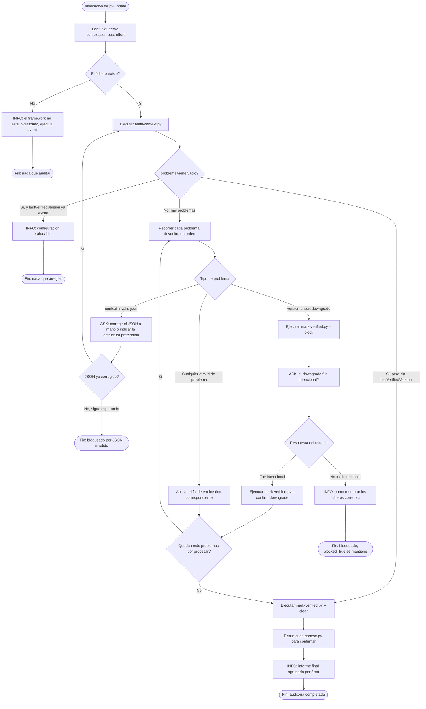

Leyenda:
- `[Texto]` — paso interno, la skill actúa sin hablar con el usuario.
- `[INFO: Texto]` — la skill informa al usuario; no bloquea, continúa sin esperar respuesta.
- `[ASK: Texto]` — la skill informa y pide confirmación/datos; bloqueante, no avanza sin respuesta del usuario.
- `{Texto}` — rama de decisión; cada arista de salida lleva su propia etiqueta.
