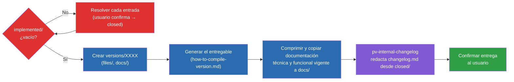

# Cómo funciona `/pv-version`

Diagrama general del proceso de preparar una entrega, sin detalle de scripts ni nombres de parámetros — pensado para mostrarse tal cual si el usuario pregunta "¿cómo funciona `/pv-version`?" durante la invocación, o como referencia en la documentación del proyecto.

Leyenda: rojo = guardarraíl de `implemented/` (bloquea hasta resolverse); azul = pasos mecánicos de `pv-version`; morado = delegado en `pv-internal-changelog`; verde = fin del proceso.
