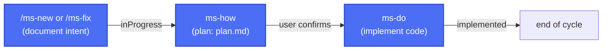

*Read this in [Spanish](README.md).*

# Previo

**Previo** is an AI-driven development framework for [Claude Code](https://claude.com/claude-code): it defines changes, validates design through mockups and diagrams, tracks the state of each change, and prepares releases — all conversationally, without rigid templates or extra tooling.

It brings the control and traceability of *spec-driven development* without the process overhead that approach usually demands in large projects. Built for projects of any size run by a single person.

## Key features

- **Complete spec, free-form.** Every entry requires just enough structure to be useful (intent, plan, state), without complex *spec* formats to learn or maintain by hand.
- **Design is always validated.** Visual changes and workflows are validated with static mockups (HTML/CSS or a custom format) before anything gets implemented — avoiding the "implement → doesn't land right → redo" cycle.
- **Speed vs. complexity.** Prioritizes speed and sequential work over parallel work, avoiding the complexity of coordinating multiple changes at once, resolving PR conflicts, or managing simultaneous branches.
- **Adaptable and versatile.** Works on projects of any size and adapts to each project's stack; some of its pieces can be extended or swapped out without touching the rest of the framework.
- **No extra tooling.** Requires nothing beyond Claude Code and Python on the development machine — no external services, databases, or infrastructure to maintain.
- **100% conversational and AI-driven.** The whole cycle (from idea to delivery) is a 100% AI-guided process, for any kind of profile. A few more tokens, much less complexity.

## Installation

Copy the [`.claude/skills`](.claude/skills) folder from this repository into the root of the project where you want to use the framework (along with `.claude/ms-guide.md` and `.claude/ms-design.md` if you want to keep the documentation). Then, from that project's root, run once:

```
/ms-init
```

This checks the required tools (Git, Python 3, and any conditional ones depending on the project's stack) and generates `.claude/ms-context.json` — the single configuration file the rest of the skills depend on: where changes are stored, whether the project versions deliverables, where the source code lives, which documentation to keep in sync, etc.

## Workflow

Each change lives in a numbered folder inside `changes/` that travels between subfolders as its state progresses: `inProgress/` → `implemented/` → `closed/`.

### Minimal flow

The mandatory cycle: document the intent and, once the user confirms, plan and implement.



- **`/ms-new <description>`** — documents new functionality or an intentional behavior change (`description.md`), generating visual mockups if applicable.
- **`/ms-fix <description>`** — fixes a bug end to end, or applies a change trivial enough (typo, text, a single value) on the spot that it doesn't warrant a `plan.md`.
- **`ms-how` + `ms-do`** — plan the technical solution (`plan.md`) and implement the code, updating the configured architecture/style/features documentation.

### Extended flow

Optional skills that complement the minimal cycle: jotting down ideas before committing, checking status, and packaging releases.


- **`/ms-todo <idea>`** — jots down a loose idea for later without committing to documenting or implementing it yet.
- **`/ms-status`** — checks the status of changes in progress, implemented, or pending release.
- **`/ms-version <code>`** — packages a release: generates the deliverable, archives the current documentation, and writes the functional changelog from what's been closed.

See [`.claude/ms-guide.md`](.claude/ms-guide.md) for the full usage guide and [`.claude/ms-design.md`](.claude/ms-design.md) for the skill map and how they invoke each other.

## License

[MIT](LICENSE)
