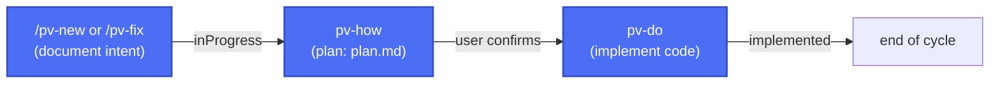

*Read this in [Spanish](README.md).*

# Previo

**Previo** is a development framework created and driven by AI for [Claude Code](https://claude.com/claude-code): it defines changes, validates design through mockups and diagrams, tracks the state of each change, and prepares releases — all conversationally, without rigid templates or extra tooling.

It brings the control and traceability of *spec-driven development* without the process overhead that approach usually demands in large projects. Built for projects of any size run by a single person.

## Table of contents

- [Key features](#key-features)
- [Installation](#installation)
- [Workflow](#workflow)
  - [Minimal flow](#minimal-flow)
  - [Extended flow](#extended-flow)
- [How it's built and how it works in detail](#how-its-built-and-how-it-works-in-detail)
- [License](#license)

## Key features

- <u>**Complete spec, free-form.**</u> Every entry requires just enough structure to be useful (intent, plan, state), without complex *spec* formats to learn or maintain by hand.
- <u>**Design is always validated.**</u> Visual changes and workflows are validated with static mockups (HTML/CSS or a custom format) before anything gets implemented — avoiding the "implement → doesn't land right → redo" cycle.
- <u>**Speed vs. complexity.**</u> Prioritizes speed and sequential work over parallel work, avoiding the complexity of coordinating multiple changes at once, resolving PR conflicts, or managing simultaneous branches.
- <u>**Adaptable and versatile.**</u> Works on projects of any size and adapts to each project's stack; some of its pieces can be extended or swapped out without touching the rest of the framework.
- <u>**No extra tooling.**</u> Requires nothing beyond Claude Code and Python on the development machine — no external services, databases, or infrastructure to maintain.
- <u>**100% made by AI, to AI.**</u> The whole cycle (from idea to delivery) is a 100% AI-guided process, for any kind of profile. A few more tokens, much less complexity.

## Installation

From the root of the project where you want to use the framework, run:

```
curl -fsSL https://raw.githubusercontent.com/yeyopepe/previo/main/install.sh | sh
```

This installs (or updates) `.claude/skills` with the framework's skills, without touching your configuration (`pv-context.json`, `settings.json`) or any custom skill that doesn't start with `pv-`. Running it again at any time updates the framework to the latest version: it adds new skills, updates existing ones, and removes any that are no longer part of Previo. If you also want to keep the documentation (`pv-guide.md`, `pv-design.md`), copy it once by hand from the repo — from then on the script will keep it in sync too.

Then, from that project's root, run once:

```
/pv-init
```

This checks the required tools (Git, Python 3, and any conditional ones depending on the project's stack) and generates `.claude/pv-context.json` — the single configuration file the rest of the skills depend on: where changes are stored, whether the project versions deliverables, where the source code lives, which documentation to keep in sync, etc.

## Workflow

Each change lives in a numbered folder inside `changes/` that travels between subfolders as its state progresses: `inProgress/` → `implemented/` → `closed/`.

### Minimal flow

The mandatory cycle: document the intent and, once the user confirms, plan and implement.



- **`/pv-new <description>`** — documents new functionality or an intentional behavior change (`description.md`), generating visual mockups if applicable.
- **`/pv-fix <description>`** — fixes a bug end to end, or applies a change trivial enough (typo, text, a single value) on the spot that it doesn't warrant a `plan.md`.
- **`pv-how` + `pv-do`** — plan the technical solution (`plan.md`) and implement the code, updating the configured architecture/style/features documentation.

### Extended flow

Optional skills that complement the minimal cycle: jotting down ideas before committing, checking status, and packaging releases.


- **`/pv-todo <idea>`** — jots down a loose idea for later without committing to documenting or implementing it yet.
- **`/pv-status`** — checks the status of changes in progress, implemented, or pending release.
- **`/pv-version <code>`** — packages a release: generates the deliverable, archives the current documentation, and writes the functional changelog from what's been closed.


## All the options

See the [user guide](.claude/pv-guide.md) for everything you can do with Previo.

## How it's built, in detail

If you want to see how it's built (the framework's skill map, how they invoke each other, the reasoning behind its architecture, etc), here's the [design document](.claude/pv-design.en.md).

## License

[MIT](LICENSE)
