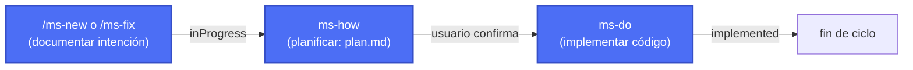

# Previo

*Read this in [English](README.en.md).*

**Previo** es un framework de desarrollo dirigido con IA para [Claude Code](https://claude.com/claude-code): define cambios, valida el diseño sobre maquetas y diagramas, gestiona el estado de cada cambio y prepara entregas — todo de forma conversacional, sin plantillas rígidas ni herramientas adicionales.

Aporta el control y la trazabilidad del *spec-driven development* sin la sobrecarga de proceso que ese enfoque suele exigir en proyectos grandes. Pensado para proyectos de cualquier tamaño y gestionados por una sola persona.

## Características principales


- <u>**Especificación completa, formato libre.**</u> Cada entrada exige la estructura mínima necesaria para ser útil (intención, plan, estado), sin formatos de *spec* complejos que haya que aprender o mantener a mano.
- <u>**Valida siempre el diseño.**</u> Visualiza y valida los cambios visuales y los flujos de trabajo con maquetas estáticas (HTML/CSS o personalizado) antes implementar nada, evitando el ciclo de "implementar → ver que no convence → rehacer".
- <u>**Velocidad vs. complejidad.**</u> Prioriza la velocidad y el trabajo secuencial frente al trabajo en paralelo, evitando la complejidad de coordinar varios cambios a la vez, resolver conflictos entre PRs o gestionar ramas simultáneas.
- <u>**Adaptable y versátil.**</u> Funciona en proyectos de cualquier tamaño y se adapta al stack de cada uno; algunas de sus piezas se pueden extender o sustituir sin tocar el resto del framework.
- <u>**Sin herramientas adicionales.**</u> No requiere más que Claude Code y Python en la máquina de desarrollo — nada de servicios externos, bases de datos ni infraestructura propia.
- <u>**100% conversacional y dirigido por IA.**</u> Todo el ciclo (desde la idea hasta su realización) es un proceso 100% guidado por IA, para cualquier tipo de perfil. Unos pocos tokens más, mucha complejidad menos.

## Instalación

Copia la carpeta [`.claude/skills`](.claude/skills) de este repositorio a la raíz del proyecto donde quieras usar el framework (junto con `.claude/ms-guide.md` y `.claude/ms-design.md` si quieres conservar la documentación). Después, desde la raíz de ese proyecto, ejecuta una vez:

```
/ms-init
```

Esto comprueba las herramientas necesarias (Git, Python 3, y las condicionales según el stack del proyecto) y genera `.claude/ms-context.json` — el único fichero de configuración del que dependen el resto de skills: dónde se guardan los cambios, si el proyecto versiona entregables, dónde está el código fuente, qué documentación mantener sincronizada, etc.

## Flujo de trabajo

Cada cambio vive en una carpeta numerada dentro de `changes/` que va viajando entre subcarpetas según su estado: `inProgress/` → `implemented/` → `closed/`.

### Flujo mínimo

El ciclo obligatorio: documentar la intención y, si el usuario confirma, planificar e implementar.



- **`/ms-new <descripción>`** — documenta funcionalidad nueva o un cambio de comportamiento intencionado (`description.md`), generando maquetas visuales si aplica.
- **`/ms-fix <descripción>`** — corrige un bug de punta a punta, o aplica al vuelo un cambio tan trivial (typo, texto, un valor puntual) que no merece pasar por `plan.md`.
- **`ms-how` + `ms-do`** — planifican la solución técnica (`plan.md`) e implementan el código, actualizando la documentación de arquitectura/estilo/funcionalidades configurada.

### Flujo extendido

Skills opcionales que complementan el ciclo mínimo: anotar ideas antes de comprometerte, consultar el estado y empaquetar entregas.


- **`/ms-todo <idea>`** — apunta una idea suelta para más adelante sin comprometerte todavía a documentarla ni implementarla.
- **`/ms-status`** — consulta el estado de los cambios en curso, implementados o pendientes de versionar.
- **`/ms-version <código>`** — empaqueta una entrega: genera el entregable, comprime la documentación vigente y redacta el changelog funcional a partir de lo cerrado.

Consulta [`.claude/ms-guide.md`](.claude/ms-guide.md) para la guía de uso completa y [`.claude/ms-design.md`](.claude/ms-design.md) para el mapa de skills y cómo se invocan entre sí.

## Licencia

[MIT](LICENSE)
