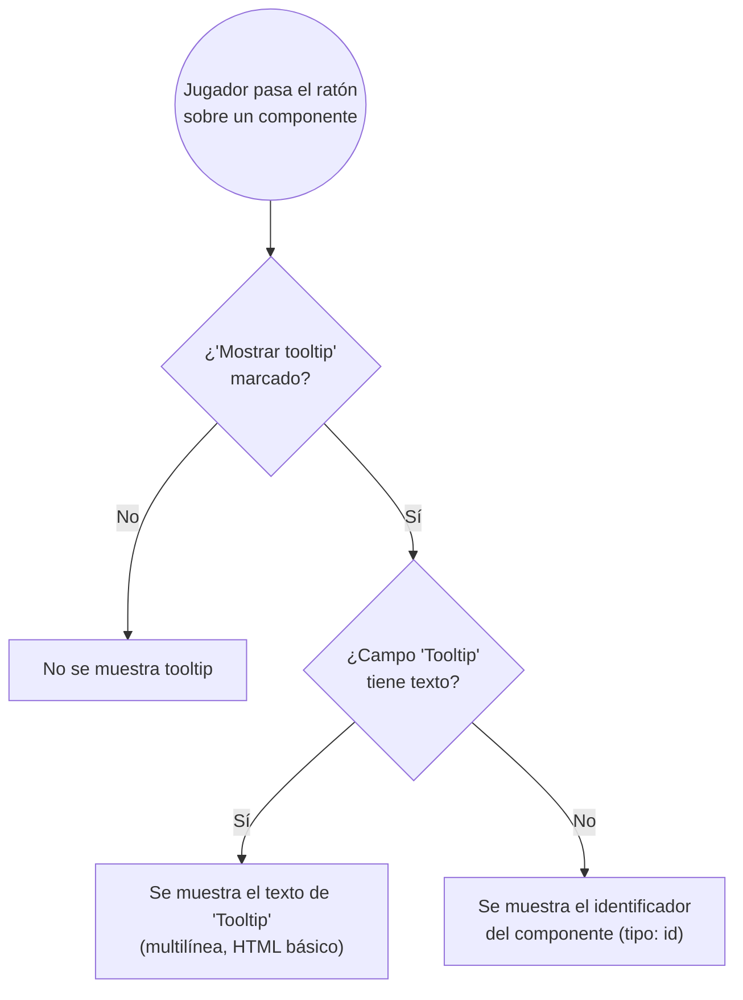

- **Name**: Sección "Ayuda jugador" en propiedades de componente, con tooltip personalizable
- **Code**: 00208
- **Type**: change
- **Creation date**: 2026-08-14

## Full description

En las propiedades de cualquier componente (pestaña "Generales"), se crea una nueva sección llamada "Ayuda jugador", situada inmediatamente debajo de la sección existente "General". Contiene:

- El checkbox "Mostrar tooltip" (se traslada aquí desde la sección "General"; su significado no cambia).
- Un campo de texto nuevo, "Tooltip": admite varias líneas y formato básico (negrita, cursiva, saltos de línea, listas simples) en el texto que verá el jugador.

### Comportamiento del tooltip en Modo Juego

- Si "Mostrar tooltip" **no** está marcado: no se muestra ningún tooltip (sin cambios respecto a hoy).
- Si está marcado y el campo "Tooltip" tiene texto: se muestra ese texto, respetando líneas múltiples y el formato básico introducido.
- Si está marcado y el campo "Tooltip" está vacío: se muestra el identificador del componente, exactamente como ocurre hoy.

### Caso especial: "Mazo"

Hoy "Mazo" siempre muestra un tooltip fijo ("Pulsa para sacar la primera carta.") en Modo Juego, sin relación con "Mostrar tooltip". A partir de este cambio, "Mazo" deja de tener ese comportamiento especial y pasa a seguir exactamente la misma lógica que el resto de tipos.

Para que un mazo recién creado se comporte igual que hoy sin que el usuario tenga que configurar nada, todo "Mazo" que se cree a partir de este cambio nace con "Mostrar tooltip" marcado y el campo "Tooltip" ya relleno con "Pulsa para sacar la primera carta.". El resto de tipos de componente siguen naciendo con "Mostrar tooltip" desmarcado y "Tooltip" vacío, sin cambios.

### Componentes ya existentes (partidas guardadas antes de este cambio)

Se aplica la regla general del proyecto, sin excepciones: un componente guardado antes de este cambio no tiene el campo "Tooltip", y su ausencia se trata como vacío. Para tipos distintos de "Mazo" esto no cambia nada observable (si "Mostrar tooltip" ya estaba marcado, se seguirá viendo el identificador, igual que hoy).

Para "Mazo" sí tiene un efecto visible: los mazos ya existentes en partidas guardadas dejan de mostrar el tooltip "Pulsa para sacar la primera carta." hasta que el usuario lo configure manualmente marcando "Mostrar tooltip" y escribiendo el texto en la nueva sección "Ayuda jugador". Se decide así explícitamente, sin migración especial para mazos preexistentes.

### Comportamiento adicional del campo "Tooltip"

- Al desmarcar "Mostrar tooltip", el campo "Tooltip" se deshabilita visualmente pero conserva el texto ya escrito, por si se vuelve a marcar más adelante.
- El texto de ayuda (icono "?") junto a "Mostrar tooltip" se actualiza para reflejar el comportamiento condicional nuevo.
- El campo "Tooltip" lleva su propio icono de ayuda, explicando que si se deja vacío se usa el identificador del componente.

### Convivencia con funcionalidad existente

- **Copias vinculadas**: el texto del campo "Tooltip" se sincroniza entre un componente original y sus copias, igual que ya ocurre con "Mostrar tooltip" y el resto de propiedades generales.
- **Copiar/pegar estilo** (disponible para "Carta"): el campo "Tooltip" se incluye junto a "Mostrar tooltip" al copiar y pegar estilo entre cartas.

## Technical notes

- Sección nueva "Ayuda jugador": `fieldset.modal__section` con `legend.modal__section-title`, mismo patrón que las demás secciones de la pestaña "Generales" de `ui/componentModal.js` (p.ej. "Tamaño", "Etiquetas"). El checkbox "Mostrar tooltip" ya existe en `ui/componentModal.js` (líneas ~460-477, dentro de la sección "General"/`infoSection`) — se traslada a la sección nueva, no se recrea.
- Campo nuevo en el modelo de datos de componente: `tooltipTexto` (string, default `''`), a documentar en `design/docs/architecture/01-component-model.md` junto a `mostrarTooltip`. Ausencia del campo en componentes guardados se trata como `''` (sin migración explícita), mismo criterio que `mostrarTooltip`/`oculto`/`subirAlMoverInteractuar`.
- El tooltip actual se implementa fijando el atributo nativo `title` del elemento DOM (`ui/componentRenderer.js`, función `formatComponentIdentifier`, usada en 6 puntos distintos del renderizado — uno por tipo, líneas ~589, 731, 965, 1109, 1332, 1553), que solo admite texto plano (sin HTML, sin saltos de línea reales). Soportar "HTML básico" y multilínea en el campo "Tooltip" requiere sustituir ese mecanismo por un tooltip propio renderizado en el DOM, al menos para el caso en que se muestre el texto personalizado — a valorar en `pv-how` si conviene unificar también el caso "se muestra el id" al mismo mecanismo nuevo, o mantenerlo con `title` nativo.
- "Mazo" (`ui/componentRenderer.js`, línea ~1778) hoy tiene su propio tooltip hardcodeado (`mazo.title = 'Pulsa para sacar la primera carta.'`), ajeno a `mostrarTooltip`/`identifyMode === 'tooltip'` que usan el resto de tipos. Este cambio requiere tocar esa rama específica para unificarla con el resto.
- Valores por defecto de "Mazo" al crearse (`mostrarTooltip: true`, `tooltipTexto: 'Pulsa para sacar la primera carta.'`) van en el mismo sitio que el resto de valores por defecto de tipo (`ui/componentTypeModal.js` + `DEFAULT_*_PROPERTIES`/`createDefaultComponent` de `ui/componentModal.js`, ver checklist de `design/docs/architecture/INDEX.md` §8 "Alta de un tipo de componente nuevo").
- Copias vinculadas: `tooltipTexto` se añade a la lista de campos "siempre propagados" documentada en `design/docs/architecture/01-component-model.md` (sección "Copias vinculadas"), junto a `mostrarTooltip`.
- Copiar/pegar estilo: `tooltipTexto` se añade en `ui/componentModal.js` junto a `mostrarTooltip` dentro de `data.generales` (botón "Copiar estilo", ~línea 1542) y en la aplicación al pegar (~línea 1580-1585).
- Texto de ayuda actual del checkbox "Mostrar tooltip" (`ui/componentModal.js`, ~línea 474-476): "Si está marcado, este componente muestra su identificador como tooltip al pasar el ratón por encima, pero solo en Modo Juego. Desmarcado por defecto." — a reescribir para reflejar el comportamiento condicional nuevo.
