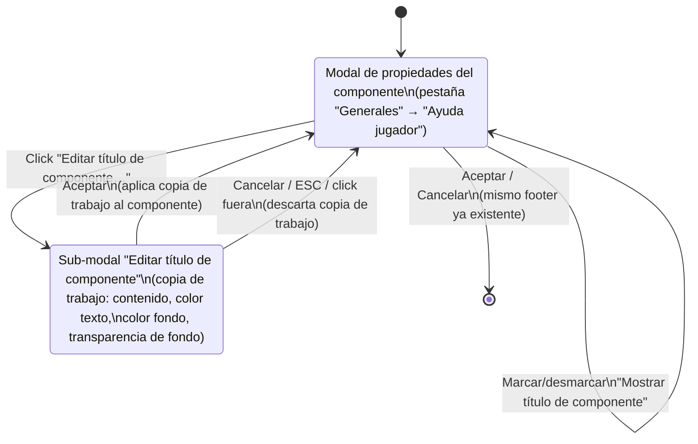

# Navegación — Abrir/cerrar la sub-modal "Editar título de componente"

Caso de uso: desde la sección "Ayuda jugador" de la modal de propiedades de un componente, el usuario activa "Mostrar título de componente" y edita su contenido/colores/transparencia en una sub-modal dedicada, sin perder el estado de la modal de propiedades que queda debajo.

Notas:

- El botón "Editar título de componente…" está siempre disponible (no depende de si "Mostrar título de componente" está marcado) — permite preparar el contenido antes de activar la visibilidad, mismo criterio que otras sub-modales de configuración del proyecto (p. ej. "Configurar fondo" de `'tableroSimple'`, accesible independientemente de otros checkboxes de esa sección).
- La sub-modal opera siempre sobre una copia de trabajo: "Cancelar" (o cerrar sin aceptar) no modifica nada del componente, igual que el resto de sub-modales ya existentes en el proyecto (`ui/boardPatternModal.js`, `ui/cardShapeModal.js`).
- Cerrar la sub-modal (por cualquier vía) siempre vuelve a la modal de propiedades tal y como estaba — no hay una tercera pantalla ni un flujo adicional.
