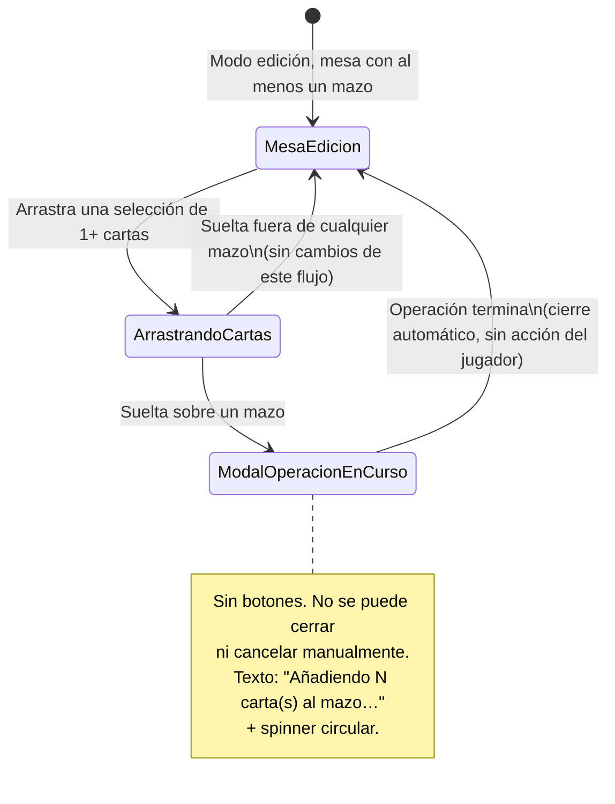

# Navegación — Modal de operación en curso al meter cartas en un mazo

- **Suelta fuera de cualquier mazo**: el arrastre se comporta como hoy (las cartas quedan en su nueva posición sobre la mesa) — no interviene este cambio.
- **Suelta sobre un mazo**: las cartas se añaden al mazo (como ya ocurre hoy, sin confirmación previa) y, mientras dura esa operación, se muestra la modal. El jugador no tiene ninguna acción disponible durante ese estado — solo espera a que se cierre sola.
- Con 1 sola carta el ciclo `ArrastrandoCartas → ModalOperacionEnCurso → MesaEdicion` es el mismo, aunque la modal pueda no llegar a percibirse por lo breve de la operación.
