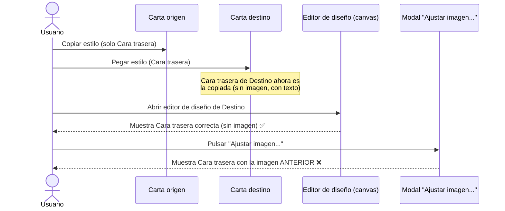

- **Name**: "Ajustar imagen..." muestra imagen antigua tras pegar estilo solo en cara trasera
- **Code**: 00192
- **Type**: fast
- **Creation date**: 2026-08-07

## Full description

En el editor de diseño de una carta, tras copiar el estilo de una carta origen marcando solo el bloque "Cara trasera" y pegarlo sobre otra carta destino, el editor visual muestra correctamente la cara trasera recién pegada: en el caso reportado, sin imagen de fondo, solo con un cuadro de texto. Hasta aquí el comportamiento es el esperado.

Sin embargo, al pulsar el botón "Ajustar imagen..." dentro de ese mismo editor (ya con el estilo pegado y visible), el modal de ajuste de imagen que se abre muestra, para la cara trasera, la imagen que tenía la carta destino ANTES de pegar el estilo — no el estado recién pegado (que no tiene imagen). Es decir, dos partes de la misma pantalla, abiertas en el mismo momento sobre el mismo componente, muestran información contradictoria entre sí.

Comportamiento esperado: el modal "Ajustar imagen..." debe reflejar siempre el estado ya pegado/actual de las caras del componente que se está editando en ese momento, igual que hace el lienzo del propio editor. Si una cara no tiene imagen tras el pegado, el modal no debería mostrar ninguna imagen antigua para esa cara (y, si ninguna cara tiene imagen, el botón no debería ni ofrecer abrir el ajuste para esa cara).

### Secuencia del bug

## Technical notes

- `core/styleClipboard.js`: portapapeles de "Copiar/Pegar estilo" en memoria, `{ generales?, proporcion?, caraFrontal?, caraTrasera? }` — solo lleva valor los bloques marcados al copiar.
- `ui/componentModal.js`, botón "Pegar estilo" (~línea 1529-1530): al pegar reemplaza por completo `props.caraTrasera = cloneFace(clip.caraTrasera)` (y/o `caraFrontal`, si ese bloque estaba marcado) sobre `workingComponent.properties`. Si solo se copió/pegó "Cara trasera", `caraFrontal` de la carta destino queda intacta.
- `ui/componentModal.js`, botón "Editar diseño de la carta" (~línea 1431-1454): abre `openVisualEditorModal({ component: workingComponent, faces: [caraFrontal, caraTrasera], ... })`.
- `ui/visualEditorModal.js`, `openVisualEditorModal` (~línea 301-316): clona `working[key] = cloneCara(props[key])` para cada cara a partir de `component.properties`, en el momento de abrir el editor (después del pegado, en el flujo reportado).
- `ui/visualEditorModal.js`, `openAdjustSession` (~línea 499-538): construye el array `faces` para `openImageAdjustModal` leyendo `working[key].imagenResourceId` de cada cara; calcula `initialFocusKey` como la PRIMERA cara (en orden frontal→trasera) que tenga `imagenResourceId`, no necesariamente la cara que el usuario acaba de pegar ni la que el usuario esperaría ver enfocada.
- `ui/imageAdjustModal.js`, `openImageAdjustModal`: recibe `faces`/`resource` ya resueltos por quien lo invoca; no cachea nada por sí mismo entre aperturas — la causa no parece estar en este módulo.
- Pista sin confirmar (a validar en el análisis de causa raíz de `pv-how`): si la carta destino conservaba, antes de pegar, una imagen también en `caraFrontal` (p.ej. porque frontal y trasera compartían la misma imagen), esa cara frontal seguiría teniendo `imagenResourceId` tras el pegado (solo se tocó `caraTrasera`). Habría que confirmar si al pulsar "Ajustar imagen..." el modal realmente enfoca/pinta datos de `caraFrontal` bajo una etiqueta de "Cara trasera", o si el problema está en otro punto (p. ej. algún dato no clonado correctamente, o un `working` que no se refresca entre el pegado y la apertura del editor en algún camino no cubierto en este análisis).
- No se han detectado incongruencias entre `design/docs/architecture/03-groups-resources.md` (portapapeles de estilo) y el código real explorado.
