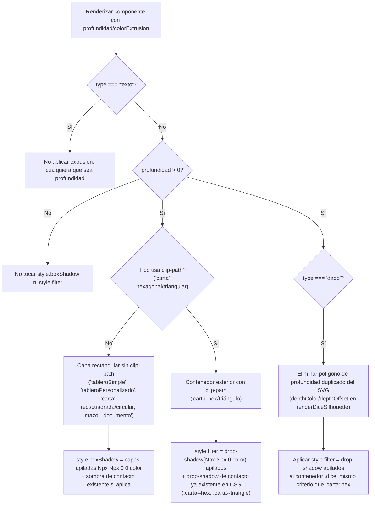

- **Creation date**: 2026-08-19
- **Risk**: 2/10 — Riesgo mínimo

## (a) Notas funcionales

**Fuera de alcance:**

- No se trocean secciones mixtas (contenido+aspecto indivisibles) para extraer solo su parte visual. Se quedan tal cual en "Específicas": `proporcionField` de `'carta'` (determina forma pero está ligado a redimensionado/contenido), el botón "Editar diseño de la carta"/"Editar diseño del tablero" (`editField`, abre el Editor visual completo — subsistema propio, no un campo suelto), la sección "Estilo de la carta" (copiar/pegar estilo — utilidad transversal, no un control visual en sí), y en `'mazo'` las secciones `revealSection` (disposición/texto/cara revelada) e `imagenSection` (imagen propia, mezcla contenido+aspecto).
- `esquinasRedondeadas` de `'carta'` **no se mueve**, porque no existe como campo suelto en `ui/componentModal.js`: se confirma en el código real (`renderCartaSpecificFields`, `ui/componentModal.js` ~L1561-1622) que ese checkbox vive dentro de `ui/visualEditorModal.js` (toolbar del Editor visual, junto al selector de Proporción) y se recibe vía el callback `onAccept` del botón "Editar diseño de la carta" — es decir, ya está dentro del subsistema del Editor visual que este cambio excluye explícitamente. No hay ningún checkbox `esquinasRedondeadas` independiente en la pestaña "Específicas" que mover a "Visuales".
- Colores/bordes definidos dentro de `caraFrontal`/`caraTrasera` (`'carta'`) o `cara` (`'tableroPersonalizado'`) no se mueven — se configuran ya dentro del Editor visual (`ui/visualEditorModal.js`), no en esta modal.
- No se añade ningún límite de profundidad distinto por tipo de componente — el mismo tope máximo (40px, ver más abajo) aplica a los 8 tipos por igual.
- No se toca `getComponentsBounds` (`ui/componentRenderer.js`): el desbordamiento visual de la extrusión se tolera sin ajuste, igual que ya ocurre hoy con el offset de profundidad de `'dado'` (confirmado en el código real: la función usa solo `x`/`y`/`width`/`height` con sus mínimos, sin ningún término de offset visual).
- No se tocan `core/persistence.js` ni `core/fileExport.js`: ambos serializan/deserializan el array `components` completo sin lista explícita de campos por componente (confirmado en `core/persistence.js`), así que `profundidad`/`colorExtrusion` se guardan/cargan automáticamente en cuanto existen en el objeto que devuelve `createComponent`/`updateComponent`, sin tocar ningún punto de persistencia — a diferencia de lo que sugiere el checklist genérico de `INDEX.md` §8 para colecciones nuevas a nivel de `state.js` (no aplica aquí: son campos de un componente ya serializado en bloque, no una colección nueva).

**Dudas resueltas con el usuario:**

- ¿Técnica visual de extrusión? → Capas sólidas apiladas (`box-shadow`/`filter: drop-shadow` duro, sin blur, offsets de 1px), no una copia con sombra difusa (la técnica actual de `'dado'` "parece solo una sombra").
- ¿Se unifica `'dado'` con la propiedad general nueva? → Sí, sustituye su mecanismo propio. **Precisión tras revisar el código real**: el mecanismo actual no es una sombra CSS — `renderDiceSilhouette` (`ui/componentRenderer.js` ~L142-236) dibuja la profundidad como un **polígono SVG adicional** (`addPolygon(points, depthColor, {x: depthOffset, y: depthOffset})`), duplicado detrás de la silueta principal, dentro del mismo `<svg>`. La sustitución no es "cambiar un box-shadow por otro": hay que eliminar ese polígono duplicado del dibujo SVG y aplicar en su lugar `style.filter` (drop-shadow apilado) sobre el contenedor `.dice`, igual que ya hace `'carta'` en proporciones hexagonal/triangular.
- ¿Color de la extrusión? → Configurable por separado (`colorExtrusion`), con cálculo automático (`shadeColor(colorBase, -0.25)`, mismo porcentaje que ya usa `'dado'` hoy) si no se especifica.
- ¿Extrusión en `'texto'`, que sí tiene `colorFondo` configurable? → Sin efecto en ningún caso, decisión explícita para no introducir una regla condicionada al estado de otra propiedad.
- ¿Alcance de la pestaña "Visuales"? → Agrupa Tamaño (trasladado desde "Generales") y Profundidad/Color de extrusión (nuevo), más las secciones ya existentes en "Específicas" cuyo propósito es puramente de aspecto (ver tabla de la tarea 6 más abajo), movidas sección completa a sección completa, sin trocear las mixtas.
- ¿Dónde se inserta la pestaña nueva? → Entre "Generales" y "Específicas". La pestaña "Copias" (ya existente, para componentes con copias vinculadas) no se ve afectada.
- Límite máximo de profundidad: **40px**, confirmado tras la comparativa visual en `design_extrusion.html` (sección 6) sin objeción del usuario.
- Decisión de diseño (no necesitó confirmación explícita, se documenta aquí por su efecto observable): al mover la sección "Fondo" completa de `'tableroSimple'` a "Visuales" (ver tarea 6), este tipo se queda sin ninguna propiedad no-visual en "Específicas" — es el caso real que activa el mensaje "Este objeto no tiene propiedades" con el catálogo de tipos actual.

## (b) Solución técnica

- [x] **`src/core/component.js` — añadir campos raíz `profundidad`/`colorExtrusion`.** En `createComponent(params)` (línea 6), añadir `profundidad = 0` y `colorExtrusion = null` a la desestructuración de parámetros, y `profundidad`/`colorExtrusion` al objeto devuelto (mismo patrón que `bloqueado`/`oculto`). `updateComponent` (línea 53) no necesita cambios: el merge superficial genérico (`{ ...component, ...changes }`) ya los propaga.
- [x] **`src/core/component.js` — sincronizar en copias vinculadas.** En `syncCopyWithOriginal` (línea 171), añadir `profundidad: original.profundidad` y `colorExtrusion: original.colorExtrusion` al objeto devuelto, junto a `width`/`height`/`mostrarTooltip` — mismo grupo de "configuración visual del original, siempre propagada" (no depende de `copy.sincronizado`, a diferencia de `bloqueado`/`oculto`).
- [x] **`src/ui/componentRenderer.js` — helper compartido para construir la extrusión.** Añadir una función `buildExtrusionLayers(profundidad, color, { asFilter })` (junto a `renderDiceSilhouette`, import de `shadeColor`/`hexToRgba` ya presente en el fichero) que, dado `profundidad` (número) y `color` (string), devuelva la cadena de capas apiladas:
  - Si `!asFilter`: `Array.from({length: profundidad}, (_, i) => \`${i+1}px ${i+1}px 0 0 ${color}\`).join(', ')` (para `box-shadow`).
  - Si `asFilter`: mismo bucle con `drop-shadow(${i+1}px ${i+1}px 0 ${color})` unidos por espacio (para `filter`).
  - Si `profundidad <= 0`, devuelve `null` (sin capas) — el llamador no toca `style.boxShadow`/`style.filter` en ese caso.
- [x] **`src/ui/componentRenderer.js` — determinar el color de extrusión por componente.** Helper `resolveExtrusionColor(component, colorBase)`: devuelve `component.colorExtrusion` si tiene valor, si no `shadeColor(colorBase, -0.25)`. `colorBase` lo calcula cada rama de tipo con su propio color de referencia: `props.colorCuerpo || '#888888'` en `'dado'` (mismo fallback que ya usa la rama existente, línea ~1190), `props.bordeColor || '#000000'` en `'tableroSimple'`/`'tableroPersonalizado'` (mismo fallback que ya usa cada rama), color de fondo de la carta (`caraActual === 'frontal' ? caraFrontal.colorFondo : caraTrasera.colorFondo`, fallback `'#ffffff'`) en `'carta'`/`'mazo'`, blanco (`'#ffffff'`) fijo en `'documento'` (sin color de referencia propio en sus properties).
- [x] **`src/ui/componentRenderer.js` — aplicar extrusión en tipos rectangulares sin `clip-path` (`box-shadow`).** Para `'tableroSimple'`, `'tableroPersonalizado'`, `'carta'`/`'mazo'` en proporciones rectangular/cuadrada/circular (sin `clip-path`), `'documento'`: tras construir el elemento, si `component.profundidad > 0`, `element.style.boxShadow = [buildExtrusionLayers(...), tieneSombraDeContacto ? 'var(--shadow-1)' : null].filter(Boolean).join(', ')`. `tieneSombraDeContacto` es `true` salvo que el tipo tenga `props.sombra === false` (`'tableroSimple'`/`'tableroPersonalizado'`, respetando su checkbox "Sombra" existente vía la clase `.board--sin-sombra`/`.tablero-personalizado--sin-sombra` — con `profundidad > 0` esa clase ya no controla el `box-shadow` final, así que el `style.boxShadow` inline debe respetar el mismo booleano directamente). Si `profundidad === 0`, **no tocar `style.boxShadow`** (se deja que la clase CSS existente controle la sombra de contacto, sin cambio de comportamiento respecto a hoy).
- [x] **`src/ui/componentRenderer.js` — aplicar extrusión en `'carta'` hexagonal/triangular (`filter: drop-shadow`).** Para `'carta'` con proporción `'hex-vertical'`/`'hex-horizontal'`/`'triangulo'`/`'triangulo-invertido'` (clase `.carta--hex, .carta--triangle`): si `profundidad > 0`, `element.style.filter = buildExtrusionLayers(profundidad, color, {asFilter: true}) + ' drop-shadow(0 2px 6px rgba(0,0,0,0.10)) drop-shadow(0 1px 2px rgba(0,0,0,0.08))'` (mismo valor estático que la clase CSS define hoy en `main.css` línea 1105, para no depender de leer el `filter` computado). Aplicar siempre al **elemento contenedor exterior** de la carta (nunca al hijo con `clip-path`), replicando el patrón ya existente en `paintCartaFace`/renderizado de carta. Si `profundidad === 0`, no tocar `style.filter` (la clase CSS sigue controlando la sombra de contacto sola).
- [x] **`src/ui/componentRenderer.js` — sustituir el mecanismo propio de `'dado'` (SVG → CSS).** En `renderDiceSilhouette` (líneas 142-236): eliminar los 4 `addPolygon(..., depthColor, {x: depthOffset, y: depthOffset})` (uno por rama de `count`: 4, 6, 8, y el `outer` del caso por defecto) y las variables `depthColor`/`depthOffset` (ya no se usan). La función deja de dibujar profundidad — solo la silueta principal, sus líneas internas y el contorno. En el punto de creación de `dice` (línea ~1167-1200): si `component.profundidad > 0`, aplicar `dice.style.filter = buildExtrusionLayers(component.profundidad, resolveExtrusionColor(component, colorCuerpo), {asFilter: true}) + ' drop-shadow(0 5px 8px rgba(0, 0, 0, 0.28))'` (mismo valor estático que `.dice` define hoy en `main.css` línea 915) sobre el contenedor `dice` (el `
`, no el `<svg>` interior) — mismo criterio que `'carta'` hexagonal: filtro en el contenedor exterior. Si `profundidad === 0`, no tocar `style.filter` (la clase `.dice` sigue controlando su sombra de contacto sola).
- [x] **`src/ui/componentModal.js` — ajustar valor por defecto de `profundidad` para `'dado'` nuevo.** En `DEFAULT_DADO_PROPERTIES` (línea 113) no se añade `profundidad` (es un campo raíz de componente, no de `properties`) — en su lugar, en el punto donde se crea un `'dado'` nuevo (`createDefaultComponent`, que construye el componente vía `createComponent(...)`), pasar `profundidad` con un valor fijo en px que aproxime visualmente el offset actual (`depthOffset = size * 0.05` con `size` por defecto de `'dado'` = `100px`, es decir `~5px` de offset percibido) — validar visualmente el valor exacto al implementar (candidato inicial: `4`-`5`), no un cálculo proporcional al tamaño.
- [x] **`src/ui/componentModal.js` — nueva pestaña "Visuales".** Insertar `createTab('visual', 'Visuales')` justo después de `createTab('general', 'Generales')` (línea 302) y antes de `createTab('specific', 'Específicas')` (línea 830), para que quede en ese orden en la UI. Guardar referencia `const visualContent = tabContents.get('visual').content;`.
- [x] **`src/ui/componentModal.js` — mover la sección "Tamaño".** Cambiar `generalContent.appendChild(sizeSection)` (línea 605) por `visualContent.appendChild(sizeSection)`. Sin más cambios: `sizeSection` es un nodo DOM ya construido de forma independiente (líneas 336-388), y no depende de closures propias de "Generales" — mover el nodo a otra pestaña no lo rompe.
- [x] **`src/ui/componentModal.js` — nuevo campo "Profundidad"/"Color de extrusión".** En `visualContent`, tras `sizeSection`, añadir un `fieldset.modal__section` con `<legend class="modal__section-title">Extrusión</legend>` y una fila de dos campos, replicando exactamente el patrón documentado en `design/docs/style/INDEX.md` §8 ("Campo de color + grosor asociado, misma fila") y usado en `borderRow`/`borderColorField`/`borderWidthField` de `renderBoardSpecificFields` (líneas 1102-1139): `div.modal__field` exterior → `div` interior (`style.display='flex'; style.gap='0.5rem'`) → dos sub-`div` con `style.flex='1'`. Campo 1 "Profundidad": `<input type="number" min="0" max="40">`, valor inicial `workingComponent.profundidad ?? 0`, listener que clampea a `[0, 40]` y escribe `workingComponent.profundidad = valor`. Campo 2 "Color de extrusión": `<input type="color">` más un checkbox/toggle "Automático" (mismo patrón que el des/activador de `.modal__section-title--toggle` de `03-modales-menus.md` §12.6, aplicado aquí al campo de color en vez de a la sección completa) que alterna entre `workingComponent.colorExtrusion = null` (automático) y el valor elegido en el `<input type="color">`. Añadido una sola vez, no por tipo — transversal a los 8 tipos, igual que "Tamaño". Para `'texto'`, el campo queda visible pero sin efecto; añadir `createHelpIcon` (patrón ya usado en el fichero para aclaraciones puntuales) junto al `legend` indicando que no tiene efecto en este tipo.
- [x] **`src/ui/componentModal.js` — mover secciones visuales específicas por tipo a `visualContent`.** Cada función `render*SpecificFields(container)` invocada desde `renderSpecificTab()` (línea 922) recibe ahora también `visualContainer` (referencia a `visualContent`) y hace `visualContainer.appendChild(...)` en vez de `container.appendChild(...)` para las secciones/campos listados:

  | Tipo | Se mueve a "Visuales" | Se queda en "Específicas" |
  |---|---|---|
  | `'texto'` | `fontSizeField`, `textColorField`, `bgColorField` (agrupados en un `fieldset` "Visual" nuevo en Visuales, no tenían fieldset propio) | `contentField` |
  | `'tableroSimple'` | sección "Visual" (`biseladoField`, `sombraField`), `borderSection` completo, campo "Fondo" (selector + botón configurar) | *(nada — activa el mensaje "Este objeto no tiene propiedades")* |
  | `'tableroPersonalizado'` | sección "Visual" (`biseladoField`, `sombraField`) | botón "Editar diseño del tablero" (`editField`) |
  | `'dado'` | `bodyColorField`, `numColorField`, `fontField` | `modeField`, `maxField`, `listField` |
  | `'documento'` | *(nada, no tiene controles visuales)* | `tipoField`, `contentField`/`formatField`, `urlField` |
  | `'carta'` | *(nada — `esquinasRedondeadas` vive dentro del Editor visual, no en esta modal, ver nota en (a))* | `proporcionField`, `editField` ("Editar diseño de la carta"), `styleSection` |
  | `'mazo'` | `formaSection` completo (Forma + Orientación) | `revealSection`, `imagenSection` |

- [x] **`src/ui/componentModal.js` — mensaje "sin propiedades" en "Específicas".** Al final de `renderSpecificTab()` (línea 922), tras invocar el `render*SpecificFields` del tipo correspondiente, si `specificContent.children.length === 0`, añadir un párrafo de mensaje ("Este objeto no tiene propiedades", texto secundario centrado — clase nueva sencilla, `.modal__empty-state` o similar, sin equivalente reutilizable ya existente en el proyecto) — no ocurre hoy con ningún tipo salvo `'tableroSimple'` tras este traslado. Implementarlo de forma genérica (comprobando `children.length`, no hardcodeando `type === 'tableroSimple'`), para que se active automáticamente con cualquier tipo futuro que se quede sin propiedades no-visuales.
- [x] **Ficheros de prueba (`src/test/*.json`).** Añadir `profundidad`/`colorExtrusion` configurados en algún componente de `src/test/errantes-componentes.json`, para poder probar el nuevo campo importando el fichero. No requiere tocar `core/persistence.js`/`core/fileExport.js` (ver nota en (a)): el import ya carga cualquier campo raíz presente en el JSON de cada componente.

## (d) Cambios de estilo

- **`design/docs/style/INDEX.md`**, sección "Bisel/profundidad" (`'tableroSimple'`, `'tableroPersonalizado'`, `'dado'`): reescribir el punto sobre `'dado'` — ya no dibuja su profundidad como polígono SVG duplicado (`renderDiceSilhouette`), pasa a usar la propiedad general `profundidad`/`colorExtrusion` y la técnica de capas sólidas apiladas (`filter: drop-shadow` sobre el contenedor `.dice`), igual que el resto de tipos. Mantener la mención al bisel de dos tonos (`'tableroSimple'`/`'tableroPersonalizado'`, sin cambios) como capa independiente y compatible con la extrusión.
- **`design/docs/style/01-tokens-visual.md`**, §6 "Elevación, sombra y transición": añadir una subsección nueva ("Extrusión configurable") documentando la técnica (capas de `box-shadow`/`filter: drop-shadow` sólidas apiladas sin blur, offset 1px por capa, color automático `shadeColor(base, -0.25)` o elegido por el usuario, tope `40px`) y su relación con el sistema de elevación existente: son conceptos independientes y compatibles (elevación = sombra de contacto con el "suelo"; extrusión = grosor/cuerpo del propio componente), sin introducir un cuarto nivel de elevación. Aclarar explícitamente que `'dado'` deja de tener mención especial en este apartado salvo como "un tipo más" que usa el mecanismo general.
- **`design/docs/architecture/01-component-model.md`**: añadir `profundidad: number` y `colorExtrusion: string | null` a la tabla "Campos generales" (con su fila de default/uso/quién lo edita, igual que el resto), y una nota en "Notas sobre migraciones silenciosas al cargar" (ausencia de campo se comporta como `0`/`null`, sin migración explícita — mismo criterio que `oculto`/`mostrarTooltip`). Añadir `profundidad: original.profundidad` y `colorExtrusion: original.colorExtrusion` a la lista de campos "siempre propagados" en "Copias vinculadas (`copyOf`)".
- **`design/docs/architecture/02-component-types.md`**, sección `'dado'`: sustituir la frase "silueta 2D plana... con un efecto de profundidad leve (copia oscura desplazada detrás)... mismo bisel/profundidad que `'tableroSimple'`" por una descripción que refleje que la profundidad ya no es parte del dibujo SVG, sino la propiedad general `profundidad`/`colorExtrusion` aplicada como `filter` sobre el contenedor.

## Diagrama — decisión de técnica CSS por tipo

## (e) Verificación

- [x] Al editar cualquier componente de cualquiera de los 8 tipos, la pestaña "Generales" ya no muestra la sección "Tamaño" y la nueva pestaña "Visuales" (entre "Generales" y "Específicas") sí la muestra, junto con "Profundidad"/"Color de extrusión".
- [x] Con `profundidad = 0` (valor por defecto salvo `'dado'`), el aspecto de cualquier componente existente no cambia respecto a antes del cambio.
- [x] Al subir la "Profundidad" de un `'tableroSimple'`, `'carta'` (proporción rectangular) o `'mazo'` por encima de 0, aparece un cuerpo sólido con grosor visible (no una sombra difusa), en el color automático (tono oscurecido del propio color) salvo que se haya elegido un "Color de extrusión" propio, en cuyo caso se usa ese color tal cual.
- [x] El bisel de `'tableroSimple'`/`'tableroPersonalizado'` y la sombra de contacto de nivel 1 siguen viéndose con normalidad junto a la extrusión, sin que ninguna sustituya a la otra.
- [x] Un `'dado'` con la `profundidad` por defecto asignada se ve con una sensación de grosor similar a la que tenía antes del cambio, pero como cuerpo sólido (filtro CSS) en vez del polígono SVG duplicado anterior.
- [x] Una `'carta'` con proporción hexagonal o triangular muestra la extrusión siguiendo su silueta recortada (no la caja rectangular), sin que el `clip-path` la deje invisible.
- [x] El campo "Profundidad" no admite valores por debajo de `0` ni por encima de `40`.
- [x] Un componente `'texto'` no muestra ningún efecto de extrusión, tenga o no tenga fondo de color configurado.
- [x] La pestaña "Específicas" de un `'tableroSimple'` muestra "Este objeto no tiene propiedades" (todos sus controles visuales se movieron a "Visuales"). El resto de tipos siguen mostrando contenido en "Específicas", incluida `'carta'` (`proporcionField`/`editField`/`styleSection` no se movieron).
- [x] Al guardar, recargar la página, o exportar/importar el fichero de partida, `profundidad`/`colorExtrusion` se conservan igual que el resto de campos del componente, sin haber tocado `core/persistence.js` ni `core/fileExport.js`.
- [x] Al cambiar `profundidad`/`colorExtrusion` en un componente original con copias vinculadas y sincronizadas, las copias reflejan el cambio automáticamente (igual que ya ocurre hoy con `width`/`height`), sin depender del estado de `sincronizado` de la copia.
